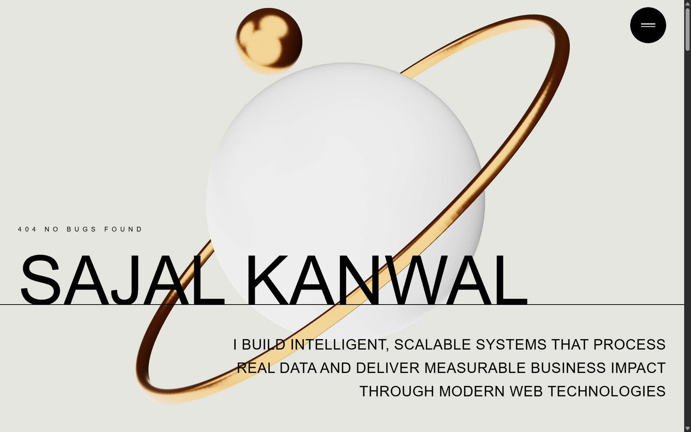

# Sajal Kanwal's Portfolio

A stunning 3D personal portfolio website built with React, Three.js, and GSAP.

[]([https://your-domain.com](https://sajal-kanwal.vercel.app/))



## 📜 Description

This is my personal portfolio website designed to showcase my skills, projects, and experience as a software developer. The website features a unique 3D interactive hero section, smooth animations, and a clean, modern design.

## ✨ Features

*   **Interactive 3D Hero Section**: A captivating hero section with an animated 3D planet model.
*   **Smooth Animations**: Seamless transitions and animations powered by GSAP.
*   **Fully Responsive**: A responsive design that looks great on all devices, from mobile to desktop.
*   **Project Showcase**: A dedicated section to display my featured projects with links to live demos and source code.
*   **Services Section**: A detailed overview of the services I offer.
*   **Contact Information**: Easy access to my email and social media profiles.

## 🛠️ Tech Stack

*   **Frontend**:
    *   [React](https://reactjs.org/)
    *   [Vite](https://vitejs.dev/)
    *   [Tailwind CSS](https://tailwindcss.com/)
*   **3D & Animations**:
    *   [Three.js](https://threejs.org/)
    *   [React Three Fiber](https://docs.pmnd.rs/react-three-fiber)
    *   [React Three Drei](https://github.com/pmndrs/drei)
    *   [GSAP (GreenSock Animation Platform)](https://greensock.com/gsap/)
*   **Scrolling**:
    *   [React Scroll](https://github.com/fisshy/react-scroll)
    *   [Lenis](https://github.com/studio-freight/lenis)

## 🚀 Getting Started

To get a local copy up and running, follow these simple steps.

### Prerequisites

*   Node.js (v18.x or later)
*   npm

### Installation

1.  Clone the repo
    ```sh
    git clone https://github.com/Sajal-kanwal/sajal-kanwal-portfolio.git
    ```
2.  Navigate to the project directory
    ```sh
    cd sajal-kanwal-portfolio
    ```
3.  Install NPM packages
    ```sh
    npm install
    ```
4.  Run the development server
    ```sh
    npm run dev
    ```
    Open [http://localhost:5173](http://localhost:5173) to view it in the browser.

## 📄 License

Distributed under the MIT License. See `LICENSE` for more information.
