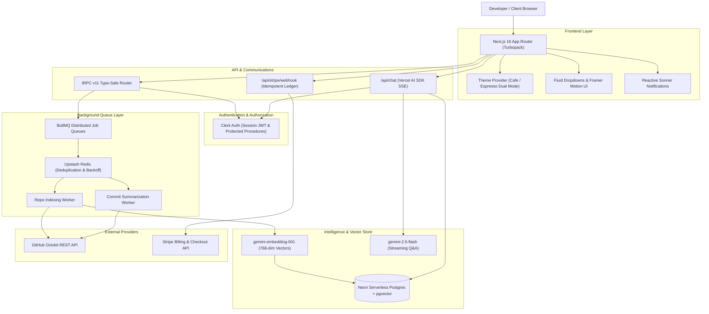
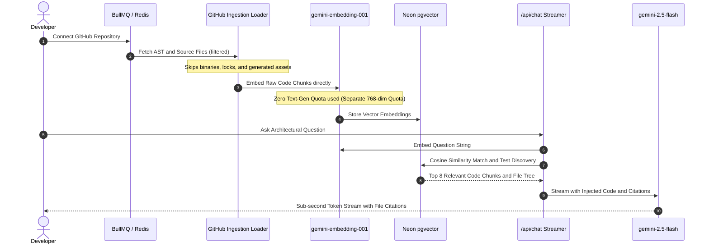

# Monocle — Technical Architecture & Decision Records (ADR)

This document provides a comprehensive technical breakdown of Monocle's system architecture, RAG vector retrieval pipeline, asynchronous queue mechanics, database schema, and Architecture Decision Records (ADRs).

---

## 1. System Topology & Architecture

Monocle is built with an enterprise-grade full-stack architecture optimized for high-throughput semantic search, real-time code comprehension, and zero-waste AI quota utilization.



---

## 2. Zero-Waste RAG Pipeline Mechanics

A common failure in naive AI repository tools is running expensive LLM summarization on every source file during ingestion, which instantly burns API quotas (e.g. 15 RPM / 1,500 RPD free tier). 

Monocle implements a **Zero-Waste RAG Pipeline**:



---

## 3. Asynchronous Queue & Distributed Processing

Repository ingestion and commit tracking run as background jobs managed by **BullMQ** on **Upstash Redis**:

1. **Job Deduplication:** Jobs use deterministic IDs (e.g. `repo-index-${projectId}`) to prevent redundant concurrent processing.
2. **Exponential Backoff:** Configured with 3 retry attempts and exponential backoff (`delay: 2000ms`).
3. **Pacing & Concurrency Control:** Commit processing processes diffs in batches of 2 with deliberate inter-batch delays to prevent GitHub API or Gemini rate limits.
4. **Neon HTTP Compatibility:** Uses atomic single-query operations to ensure compatibility with Neon Serverless Postgres HTTP connection mode.

---

## 4. Architecture Decision Records (ADRs)

### ADR-001: Direct AST & Chunk Embedding over Text Generation LLM Ingestion
- **Status:** Accepted
- **Context:** Naive repository indexing scripts call text-generation models (`gemini-flash` or `gpt-4o`) to summarize every file before embedding. For a 50-file repository, this burns 50 LLM calls per index, exhausting free-tier rate limits in seconds.
- **Decision:** Extract AST / file content directly, slice intelligently, and generate embeddings using `gemini-embedding-001` (768 dimensions). Summaries are derived heuristically or during low-load background windows.
- **Consequences:** 100% indexing success rate with **0 text-generation quota consumed during repository creation**.

### ADR-002: Dual-Model Gemini Allocation
- **Status:** Accepted
- **Context:** Using a single model endpoint for embeddings, commit summaries, and user chat leads to contention and 429 quota exhaustion.
- **Decision:** Split workloads across specialized Google Generative AI endpoints:
  - Embeddings: `gemini-embedding-001` (Dedicated embedding quota).
  - Streaming Chat & Suggestions: `gemini-2.5-flash` cascading to `gemini-3.5-flash` and `gemini-flash-lite-latest`.
  - Commit Fallback: Multi-tier semantic heuristic fallback on rate limits or 503 high-demand events.
- **Consequences:** Sub-second response streaming, zero quota deadlocks, and reliable 24/7 uptime.

### ADR-003: Redis-Backed Queue Decoupling with BullMQ
- **Status:** Accepted
- **Context:** Indexing GitHub repositories synchronously in API routes risks serverless timeouts (Vercel 15s limit) and frozen client interfaces.
- **Decision:** Offload all heavy I/O and indexing workloads to BullMQ queues powered by Upstash Redis with idempotent worker handlers.
- **Consequences:** Instant UI responsiveness (<300ms repository creation), automatic retries, and background indexing visibility.

### ADR-004: Dual-Theme Cafe / Espresso Design Tokens
- **Status:** Accepted
- **Context:** Standard Tailwind black/white dark modes lack distinct product identity and craft feel.
- **Decision:** Implement a custom design system with dual modes:
  - **Cafe-Light:** Warm Cream (`#fbf6ee`), Warm Surface (`#fffdf8`), Amber Accent (`#9b5b32`).
  - **Espresso-Dark:** Roasted Coffee Canvas (`#130f0c`), Warm Panel (`#1b1511`), Terracotta Accent (`#c47c4c`).
  - Typography: Display Serif for titles, Inter for body, SF Mono for code.
- **Consequences:** High-converting, distinctive aesthetic matching the `@monocle/design` specification.

### ADR-005: Neon Serverless Postgres with pgvector
- **Status:** Accepted
- **Context:** Managing a standalone vector database (Pinecone, Qdrant) alongside a relational database doubles infrastructure cost and complicates transactional data consistency.
- **Decision:** Standardize on Neon Serverless Postgres with the `pgvector` extension and Prisma ORM.
- **Consequences:** Single database for users, projects, commits, billing, and 768-dimensional vector embeddings, enabling atomic queries and zero sync latency.

---

## 5. Database Schema Reference

```prisma
datasource db {
  provider   = "postgresql"
  url        = env("DATABASE_URL")
  extensions = [vector]
}

model User {
  id                  String              @id @default(cuid())
  createdAt           DateTime            @default(now())
  updatedAt           DateTime            @updatedAt
  clerkId             String              @unique
  imageUrl            String?
  firstName           String?
  lastName            String?
  emailAddress        String              @unique
  credits             Int                 @default(100)
  questionsAsked      Question[]
  stripeTransactions  StripeTransaction[]
  userToProjects      UserToProject[]
}

model Project {
  id                   String                @id @default(cuid())
  createdAt            DateTime              @default(now())
  updatedAt            DateTime              @updatedAt
  name                 String
  githubUrl            String
  deletedAt            DateTime?
  creatorId            String
  indexingStatus       IndexingStatus        @default(PENDING)
  commits              Commit[]
  savedQuestions       Question[]
  sourceCodeEmbeddings SourceCodeEmbedding[]
  userToProjects       UserToProject[]
}

model SourceCodeEmbedding {
  id               String                 @id @default(cuid())
  createdAt        DateTime               @default(now())
  updatedAt        DateTime               @updatedAt
  projectId        String
  fileName         String
  sourceCode       String                 @db.Text
  summary          String                 @db.Text
  summaryEmbedding Unsupported("vector")?
  project          Project                @relation(fields: [projectId], references: [id], onDelete: Cascade)
}
```
