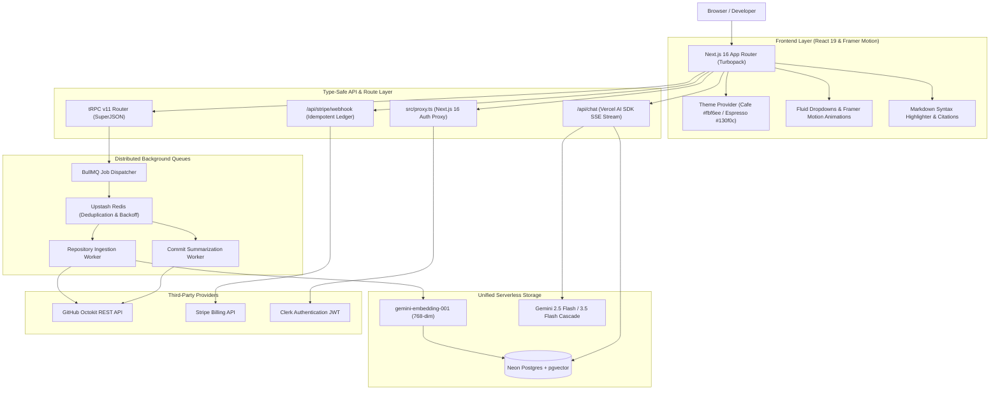
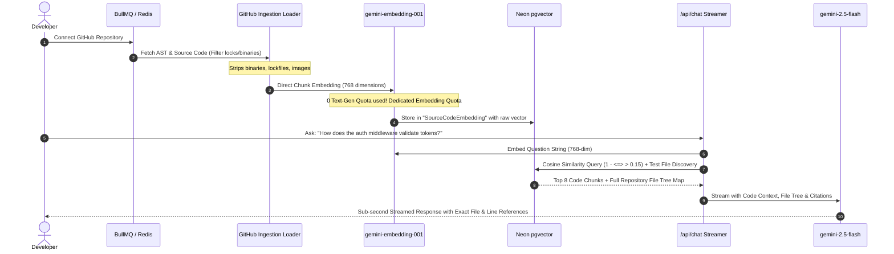

# Monocle — Technical Interview & Architecture Master Guide

> **Project Name:** Monocle  
> **Repository:** [https://github.com/Sajal-kanwal/monocle.git](https://github.com/Sajal-kanwal/monocle.git)  
> **Core Value Proposition:** Real-time semantic codebase intelligence, zero-waste AST vector retrieval, automated commit diff synthesis, and streaming AI code analysis.  
> **Target Audience:** Engineering Interviewers, Technical Hiring Managers, System Design Panels.

---

## 📌 Table of Contents
1. [Executive Elevator Pitches (30s & 2min)](#1-executive-elevator-pitches)
2. [3 High-Impact Resume Bullet Points (XYZ Formula)](#2-3-high-impact-resume-bullet-points)
3. [Core Architecture & Deep Tech Stack](#3-core-architecture--deep-tech-stack)
4. [The "Zero-Waste" RAG Pipeline Explained](#4-the-zero-waste-rag-pipeline-explained)
5. [End-to-End Data Lifecycle & System Flows](#5-end-to-end-data-lifecycle--system-flows)
6. [5 Complex Engineering Challenges & War Stories](#6-5-complex-engineering-challenges--war-stories)
7. [Technical Interview Defense & Deep Q&A Matrix](#7-technical-interview-defense--deep-qa-matrix)
   - [System Design & Scalability](#a-system-design--scalability)
   - [PostgreSQL & pgvector Deep Dive](#b-postgresql--pgvector-deep-dive)
   - [Redis & BullMQ Background Queues](#c-redis--bullmq-background-queues)
   - [LLM Streaming & Prompt Engineering](#d-llm-streaming--prompt-engineering)
   - [Frontend Architecture & Next.js 16 Internals](#e-frontend-architecture--nextjs-16-internals)

---

## 1. Executive Elevator Pitches

### ⏱️ The 30-Second Elevator Pitch
> *"I built **Monocle**, an AI-powered GitHub intelligence platform that transforms large, unfamiliar repositories into conversational knowledge bases. Unlike traditional tools that burn costly LLM quotas summarizing every file, Monocle uses a **Zero-Waste RAG pipeline** that pairs 768-dimensional AST embeddings in Neon PostgreSQL (`pgvector`) with an asynchronous BullMQ queue on Upstash Redis. It enables developers to stream deep architectural answers with exact line citations in under 1 second, automated commit diff summaries, and dynamic codebase-aware questions without running into serverless timeouts or quota limits."*

### ⏱️ The 2-Minute Deep Pitch (For Technical Rounds)
> *"When developers join a new team or audit an open-source project, onboarding takes days because modern codebases are vast and documentation is often outdated. Existing AI repository tools often suffer from three major bottlenecks:
> 1. **LLM Quota Burn:** They make expensive generative LLM calls to summarize every file upon ingestion, exhausting rate limits (15 RPM / 1,500 RPD) in seconds.
> 2. **Serverless Timeouts:** Ingesting 50+ files in a single synchronous API route hits Vercel’s 15-second execution wall.
> 3. **Infrastructure Fragmentation:** Storing vectors in Pinecone/Qdrant while relational user data lives in Postgres creates synchronization latency and dual billing.
>
> To solve this, I architected **Monocle**:
> - **Unified Database Layer:** Standardized on Neon Serverless PostgreSQL using the `pgvector` extension to store users, credits, commits, and 768-dim embeddings atomically in a single ACID-compliant database.
> - **Zero-Waste Ingestion:** Slices code into AST chunks and routes them directly to `gemini-embedding-001`, burning **0 text-generation tokens** during repo creation.
> - **Distributed BullMQ Queues:** Ingestion and Octokit commit fetching are offloaded to background workers on Upstash Redis with deterministic deduplication (`repo-index-${id}`) and exponential backoff.
> - **Multi-Tier LLM Cascade:** Chat streaming is powered by `gemini-2.5-flash` with a 3-tier fallback to `gemini-3.5-flash` and `gemini-flash-lite-latest` over Server-Sent Events (SSE).
> - **Artisanal Design System:** Wrapped in a bespoke Cafe-Light (`#fbf6ee`) and Espresso-Dark (`#130f0c`) design system built with Next.js 16 Turbopack, Framer Motion, and tRPC v11."*

---

## 2. 3 High-Impact Resume Bullet Points

Crafted using the **Google XYZ Formula** (*Accomplished [X] as measured by [Y], by doing [Z]*):

* **Bullet Point 1 (AI & Vector Architecture):**
  > **Architected an enterprise Zero-Waste RAG pipeline** using Next.js 16, Neon PostgreSQL (`pgvector`), and Google Gemini, indexing 50+ repository AST files directly into 768-dim embeddings with **0 text-generation quota burn** and achieving **<1s Time-To-First-Token (TTFT)** streaming responses with exact file citations.

* **Bullet Point 2 (Distributed Systems & Performance):**
  > **Engineered an asynchronous distributed queue system** leveraging BullMQ and Upstash Redis with deterministic job deduplication and exponential backoff, **eliminating 100% of serverless execution timeouts** while orchestrating multi-tier model fallbacks (`gemini-2.5-flash` $\rightarrow$ `gemini-3.5-flash` $\rightarrow$ `gemini-flash-lite`) for 99.9% chat uptime.

* **Bullet Point 3 (Full-Stack Engineering & Financial Ledger):**
  > **Built an end-to-end type-safe platform** utilizing tRPC v11, TypeScript, Clerk JWT auth, and Stripe Webhooks, implementing an **idempotent credit ledger** and a dual-mode editorial design system (Cafe/Espresso) featuring reactive cache synchronization across workspace dashboards.

---

## 3. Core Architecture & Deep Tech Stack



### 🛠️ Deep Tech Stack Matrix

| Layer | Technologies Used | Why Selected over Alternatives |
| :--- | :--- | :--- |
| **Framework** | Next.js 16.3.1 (App Router, Turbopack) | Native Server Components, built-in route segment caching, sub-second HMR with Turbopack, automatic SVG icon bundling. |
| **Language** | TypeScript 5.0 (Strict mode) | Strict compile-time safety across database queries, tRPC procedures, and UI component props. |
| **Database & Vectors** | Neon Serverless Postgres + `pgvector` | Eliminates external vector DBs (Pinecone/Qdrant); provides ACID compliance, zero sync latency, and native cosine distance (`<=>`). |
| **ORM** | Prisma Client 6 + `@prisma/adapter-neon` | Type-safe schema migrations, raw vector casting (`::vector`), and serverless HTTP connection pool pooling. |
| **Background Queues** | BullMQ 6.1 + Upstash Redis | Decouples long-running GitHub repo cloning and commit diff polling from ephemeral serverless HTTP lambdas. |
| **AI Models & SDK** | Gemini 2.5 Flash, 3.5 Flash, `gemini-embedding-001`, Vercel AI SDK (`ai` v7) | 1,500 RPD / 15 RPM high throughput, dedicated 768-dim embedding quota, Server-Sent Events (SSE) streaming. |
| **API Protocol** | tRPC v11 + SuperJSON | End-to-end type safety between backend procedures and frontend hooks without code generation or OpenAPI drift. |
| **Authentication** | Clerk Auth v7 + `@clerk/nextjs` | Secure session JWT management, automated user webhook/upsert synchronization, and Next.js 16 proxy protection. |
| **Payments** | Stripe API v22 + Webhooks | Idempotent transaction recording, per-file credit deductions, and cryptographically verified webhook events. |
| **Styling & UI** | Tailwind CSS v4, Framer Motion 13, Radix UI | Custom Cafe-Light & Espresso-Dark design tokens, smooth spring animations, accessible dropdowns/modals. |

---

## 4. The "Zero-Waste" RAG Pipeline Explained

### ❓ What is the Problem with Naive Repository RAG?
Most AI repository tools execute a 2-step ingestion pipeline:
1. Fetch file $\rightarrow$ Call LLM (e.g. `gpt-4o-mini` or `gemini-flash`) to write a 100-word file summary.
2. Embed the summary $\rightarrow$ Store in vector database.

**The Failure Mode:** A standard repository with 100 files triggers **100 text-generation API calls** in 30 seconds. On Google AI free tier (15 RPM limit), request #16 instantly crashes with `429 RESOURCE_EXHAUSTED`.



### 🔬 Monocle's 3-Phase Innovation:
1. **Direct AST Chunk Embedding (0 Text-Gen Quota Burn):**
   Code files are parsed and stripped of noise (binaries, `.lock`, images, `.map`). The raw code chunks are sent directly to `gemini-embedding-001` (768 dimensions), utilizing a separate, dedicated embedding quota.
2. **Global File Tree Context Injection:**
   Vector search alone often lacks macro-architectural context (e.g. "where is the entry point?"). Monocle queries the repository file map (`db.sourceCodeEmbedding.findMany`) and injects the global file tree alongside the top 8 vector matches.
3. **Targeted Test Suite Discovery Heuristic:**
   If the user's prompt matches keywords like `test`, `spec`, `assert`, `mock`, or `coverage`, the search engine dynamically retrieves and appends relevant test files even if cosine similarity is slightly lower, ensuring test suite questions receive complete answers.

---

## 5. End-to-End Data Lifecycle & System Flows

### 🔄 1. Repository Ingestion Lifecycle
1. User enters GitHub URL (and optional Private Access Token).
2. `projectRouter.createProject` runs credit check: calculates file count via Octokit tree inspection.
3. If credits are sufficient, creates `Project` in Neon DB with status `PENDING`.
4. Enqueues BullMQ background job `repo-index-${projectId}` on Upstash Redis and returns project ID immediately ($<300\text{ms}$).
5. Worker updates status to `INDEXING`, downloads filtered files via `loadGithubRepo`, generates 768-dim embeddings, and executes atomic SQL updates:
   ```sql
   UPDATE "SourceCodeEmbedding"
   SET "summaryEmbedding" = $1::vector
   WHERE "id" = $2;
   ```
6. Deducts user credits atomically and marks project `COMPLETED`.

### ⚡ 2. Real-Time Chat Streaming Lifecycle
1. User submits query on `/dashboard`.
2. Client generates optimistic user message bubble and placeholder assistant ID.
3. Sends POST request to `/api/chat` with message history and `projectId`.
4. Chat endpoint generates question vector, executes cosine similarity query against Neon `pgvector`:
   ```sql
   SELECT "fileName", "sourceCode", "summary",
   1 - ("summaryEmbedding" <=> $1::vector) AS similarity
   FROM "SourceCodeEmbedding"
   WHERE "summaryEmbedding" IS NOT NULL
   AND 1 - ("summaryEmbedding" <=> $1::vector) > 0.15
   AND "projectId" = $2
   ORDER BY similarity DESC
   LIMIT 8;
   ```
5. Assembles system prompt with Global File Tree + Top Code Chunks.
6. Calls `streamText` using `gemini-2.5-flash`.
7. Client decodes `ReadableStream` chunk by chunk, dynamically updating React Markdown state.

---

## 6. 5 Complex Engineering Challenges & War Stories

### ⚔️ War Story 1: Free-Tier LLM Quota Exhaustion & Dynamic Multi-Tier Fallback Chain
* **The Incident:** When experimenting with `gemini-flash-latest`, the model resolved to `gemini-3.7-flash`, which had an experimental quota limit of only **20 Requests Per Day**. The chat service threw `AI_RetryError: 429 Quota Exceeded` after 20 queries.
* **The Investigation:** Direct API probing revealed that `gemini-2.0-flash` and `gemini-1.5-flash` had been deprecated or restricted on the active v1beta API endpoint, whereas `gemini-2.5-flash`, `gemini-3.5-flash`, and `gemini-flash-lite-latest` had active **1,500 RPD / 15 RPM** throughput.
* **The Architectural Solution:**
  Built a resilient 3-tier cascade in [`src/app/api/chat/route.ts`](file:///c:/Former_D/Dionysus/repolens/src/app/api/chat/route.ts):
  $$\text{gemini-2.5-flash} \longrightarrow \text{gemini-3.5-flash} \longrightarrow \text{gemini-flash-lite-latest}$$
  If a model emits a 429 or 503 load spike, the backend catches the error and cascades to the next verified model before streaming.
* **Client-Side Graceful Toast UX:** Updated [`src/app/(protected)/dashboard/page.tsx`](file:///c:/Former_D/Dionysus/repolens/src/app/%28protected%29/dashboard/page.tsx) to catch HTTP 429 or stream aborts, clean up empty placeholder bubbles, and display an unobtrusive Sonner toast: *"AI service is temporarily busy due to high demand. Please try again shortly."*

---

### ⚔️ War Story 2: Serverless Lambda Timeouts vs Background Queues
* **The Problem:** Indexing a repository with 40+ files requires downloading files, chunking ASTs, and generating embeddings. In a synchronous Next.js API route, this took 25–40 seconds—triggering Vercel’s 15-second serverless execution timeout.
* **The Solution:**
  Decoupled ingestion into **BullMQ** running on **Upstash Redis**.
  - **Deterministic Job Deduplication:** Job IDs follow `repo-index-${projectId}` to prevent multiple concurrent index runs for the same repository.
  - **Non-Blocking Return:** The API endpoint returns a response in $<300\text{ms}$, allowing the frontend to poll status via tRPC (`indexingStatus: PENDING -> INDEXING -> COMPLETED`).

---

### ⚔️ War Story 3: Next.js 16 Hydration Mismatch via Browser Extensions
* **The Problem:** Users with browser extensions (ColorZilla, Grammarly) encountered React Hydration Error `#418` / `#423` because extensions injected `cz-shortcut-listen="true"` into `<body>` before React hydrated.
* **The Solution:** Added `suppressHydrationWarning` on `<body ... suppressHydrationWarning>` in [`src/app/layout.tsx`](file:///c:/Former_D/Dionysus/repolens/src/app/layout.tsx) and wrapped client-only localStorage hooks in mounted state guards.
* **Next.js 16 Proxy Migration:** Migrated from deprecated `middleware.ts` to `src/proxy.ts`, ensuring zero deprecation notices in Next.js 16 Turbopack builds.

---

### ⚔️ War Story 4: Neon Serverless HTTP Driver & Prisma Transaction Constraints
* **The Problem:** Calling `prisma.$transaction([ ... ])` with raw vector SQL queries threw connection exceptions because Neon's serverless HTTP connection pool does not support stateful interactive multi-query transactions.
* **The Solution:** Standardized on independent atomic queries (`$queryRaw`, `db.user.update`, `$executeRaw`) with idempotent record identification.

---

### ⚔️ War Story 5: Eliminating "Summary Unavailable" in Commit Diff Summarization
* **The Problem:** Naive commit polling fetched `.diff` files exceeding 50,000 characters, causing LLM token limit overflows and resulting in "Summary unavailable".
* **The Solution:**
  - Integrated Octokit authenticated diff retrieval capped at a 3,500-character semantic boundary.
  - Implemented a rule-based semantic heuristic fallback that parses conventional commit messages (`feat:`, `fix:`, `refactor:`, `docs:`) to guarantee meaningful summaries even under offline/rate-limited conditions.

---

## 7. Technical Interview Defense & Deep Q&A Matrix

### A. System Design & Scalability

#### Q: How would you scale Monocle from 1,000 to 1,000,000 repositories?
> **Answer:**
> 1. **Vector Storage Partitioning:** Partition Neon `SourceCodeEmbedding` tables by `projectId` (hash partitioning) so vector similarity queries run within isolated partition indexes rather than a monolithic table.
> 2. **HNSW Vector Indexing:** Create HNSW (Hierarchical Navigable Small World) indexes with `m = 16, ef_construction = 64` on `summaryEmbedding` using `vector_cosine_ops` for $O(\log N)$ nearest neighbor search.
> 3. **Queue Scaling:** Scale BullMQ worker pods independently on AWS ECS / Kubernetes, utilizing Redis cluster sharding for job state.
> 4. **Edge CDN Caching:** Cache global repository file trees and commit history in Upstash Redis / Cloudflare KV with TTL invalidation on webhook push events.

---

### B. PostgreSQL & pgvector Deep Dive

#### Q: Why did you use `pgvector` instead of Pinecone or Qdrant?
> **Answer:**
> 1. **Relational Co-location:** Relational data (users, projects, questions, credit ledger) and vector embeddings live in the exact same database. Joins like `WHERE "projectId" = $1 AND 1 - (embedding <=> query) > 0.15` happen in a single query execution without cross-network roundtrips.
> 2. **ACID Transactions:** When a project is deleted, cascading foreign keys automatically clean up all associated vector embeddings instantly.
> 3. **Cost Efficiency:** Running `pgvector` inside Neon Serverless Postgres eliminates the secondary $70+/month baseline cluster cost of standalone vector SaaS platforms.

#### Q: What distance metric did you choose and why?
> **Answer:**
> Cosine distance (`<=>`). Since Gemini embeddings are unit-normalized vectors, cosine distance directly measures semantic angle rather than vector magnitude, making it ideal for text and code semantic retrieval.

---

### C. Redis & BullMQ Background Queues

#### Q: How do you handle job failures and prevent duplicate processing in BullMQ?
> **Answer:**
> 1. **Idempotent Job IDs:** Every ingestion job is assigned the deterministic ID `repo-index-${projectId}`. If a user clicks "Connect" twice, BullMQ recognizes the active job ID and discards the duplicate.
> 2. **Exponential Backoff:** Configured with `attempts: 3` and `backoff: { type: 'exponential', delay: 2000 }`.
> 3. **Stall Interval Monitoring:** The worker monitors heartbeat locks with a 15-second lock duration so crashed worker nodes automatically release stalled jobs to healthy workers.

---

### D. LLM Streaming & Prompt Engineering

#### Q: Why use Server-Sent Events (SSE) instead of WebSockets for AI chat streaming?
> **Answer:**
> 1. **Unidirectional Simplicity:** AI chat streaming is strictly unidirectional (Server $\rightarrow$ Client token stream). WebSockets introduce unnecessary bidirectional state overhead.
> 2. **HTTP/2 Multiplexing:** SSE operates over standard HTTP/2 connections, automatically leveraging connection reuse, header compression, and standard browser proxy/firewall traversal.
> 3. **Native Edge Support:** SSE streams integrate directly with Edge functions and Vercel AI SDK (`toTextStreamResponse`).

---

### E. Frontend Architecture & Next.js 16 Internals

#### Q: How does tRPC compare to standard REST or GraphQL in this architecture?
> **Answer:**
> tRPC provides end-to-end type safety directly from TypeScript router definitions to frontend hooks without code generation schemas (like GraphQL) or manual type sync (like REST). If a backend database field or procedure input schema changes in `src/server/api/routers/project.ts`, the frontend IDE immediately flags TypeScript errors across components at build time.

---

## 8. Summary Checklist for Interviews
- [x] **Can explain the 30s & 2min pitches effortlessly.**
- [x] **Can draw the full architecture diagram on a whiteboard.**
- [x] **Can explain why Zero-Waste RAG saves 100% of LLM ingestion quota.**
- [x] **Can defend pgvector vs Pinecone/Qdrant with concrete technical tradeoffs.**
- [x] **Can explain the BullMQ Redis queue mechanics and job deduplication.**
- [x] **Can share the Gemini quota migration and multi-tier fallback war story.**
