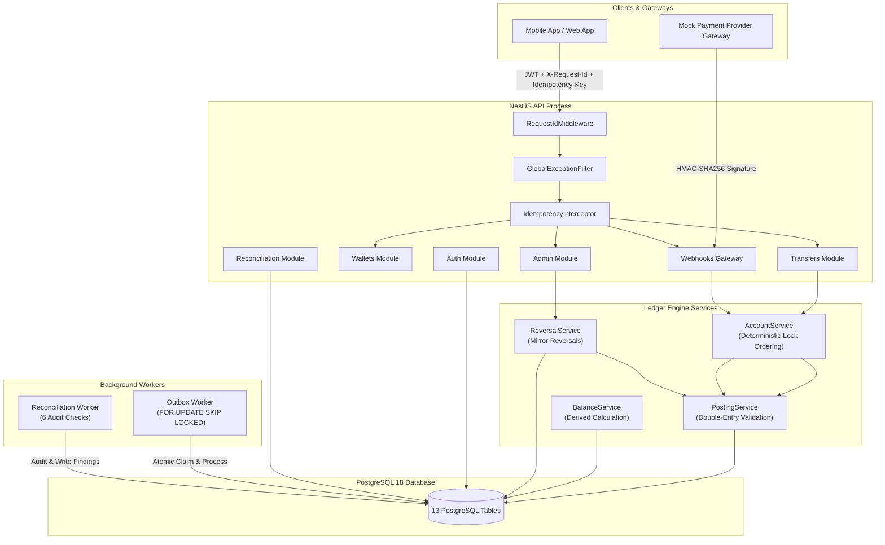
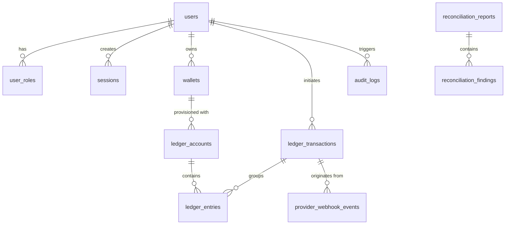

# LedgerCore — Consolidated Full Documentation & Architectural Specification

---

# Table of Contents

1. [Executive Summary & System Vision](#1-executive-summary--system-vision)
2. [Product Requirements Document (PRD)](#2-product-requirements-document-prd)
3. [System Architecture & Core Engine Design](#3-system-architecture--core-engine-design)
4. [Database Design & Data Models](#4-database-design--data-models)
5. [Core Invariants & Financial Engineering Logic](#5-core-invariants--financial-engineering-logic)
6. [API Specification & Endpoints](#6-api-specification--endpoints)
7. [Security, Authentication & Authorization](#7-security-authentication--authorization)
8. [Background Processing & Workers](#8-background-processing--workers)
9. [Automated Reconciliation & Audit Trail](#9-automated-reconciliation--audit-trail)
10. [Setup, Deployment & Testing Guide](#10-setup-deployment--testing-guide)
11. [Senior Technical Interview Preparation Guide](#11-senior-technical-interview-preparation-guide)

---

# 1. Executive Summary & System Vision

### Purpose
**LedgerCore** is a correctness-first backend platform designed for posting, storing, and reconciling financial transactions. The system models customer wallets as accounts in an immutable double-entry ledger rather than as mutable database rows. A wallet balance is a derived view produced by calculating historical ledger entries, ensuring total mathematical explainability and zero balance drift.

### Core Value Proposition
Traditional financial implementations store a single mutable `balance` column (`UPDATE wallets SET balance = balance + 100`). Under high concurrency, network failures, or webhooks retries, mutable balance columns suffer from **lost updates**, **double-spending**, and **untraceable balance drift**.

LedgerCore resolves these vulnerabilities through 5 strict invariants:
1. **Double-Entry Accounting**: Every transaction consists of balanced debits and credits ($\sum \text{Debits} - \sum \text{Credits} = 0$ per currency).
2. **Immutable History**: Records are **INSERT-ONLY**. Errors and refunds are resolved through opposing mirror entries.
3. **Pessimistic Locking**: Account UUIDs are sorted deterministically before executing `SELECT ... FOR UPDATE`, eliminating database deadlocks during concurrent money transfers.
4. **Distributed Idempotency**: All business mutations require an `Idempotency-Key` header with payload fingerprinting.
5. **Transactional Outbox**: Side effects are committed in the same database transaction as financial writes, guaranteeing at-least-once event delivery via background workers.

---

# 2. Product Requirements Document (PRD)

## 2.1 User Personas & Role Matrix

- **Customer**: Owns wallets, deposits funds via webhooks, initiates transfers to other wallets, and views transaction history.
- **Support Agent**: Investigates customer complaints, views wallet history, ledger entries, and webhook events (Read-Only).
- **Finance Operator**: Audits daily reconciliation reports, reviews financial findings, and monitors ledger health.
- **Admin**: Manages system roles, executes transaction reversals, replays outbox events, and oversees system security.

### Role-Based Access Control (RBAC) Matrix

| Endpoint Category | `customer` | `support` | `finance_ops` | `admin` |
|---|:---:|:---:|:---:|:---:|
| `POST /api/wallets` | ✅ | ❌ | ❌ | ✅ |
| `GET /api/wallets/:id` | Own Only | ✅ | ✅ | ✅ |
| `POST /api/transfers` | ✅ | ❌ | ❌ | ✅ |
| `POST /api/webhooks/mock-provider` | System | System | System | System |
| `POST /api/admin/transactions/:id/reverse` | ❌ | ❌ | ✅ | ✅ |
| `POST /api/admin/outbox/events/:id/replay` | ❌ | ❌ | ❌ | ✅ |
| `GET /api/admin/reconciliation/reports` | ❌ | ❌ | ✅ | ✅ |
| `POST /api/admin/reconciliation/reports/run` | ❌ | ❌ | ✅ | ✅ |

---

# 3. System Architecture & Core Engine Design



---

# 4. Database Design & Data Models

LedgerCore uses PostgreSQL 18 managed via Prisma ORM with 13 relational tables and strict CHECK constraints:



### Table Definitions & Keys
1. **`users`**: Identity record (`id` UUID, `email` Unique, `password_hash`, `status`).
2. **`user_roles`**: Compound key `(user_id, role)` supporting `customer`, `support`, `finance_ops`, `admin`.
3. **`sessions`**: Refresh token rotation storage with `family_id` for reuse detection.
4. **`wallets`**: Wallet container (`id` UUID, `owner_user_id`, `public_ref` Unique, `status`).
5. **`ledger_accounts`**: Chart of Accounts (`wallet_id`, `code` Unique, `account_type`, `normal_balance`, `currency`).
6. **`ledger_transactions`**: Immutable transaction header (`reference_type`, `reference_id` Unique, `status`, `reversed_transaction_id`).
7. **`ledger_entries`**: Double-entry rows (`ledger_transaction_id`, `ledger_account_id`, `direction`, `amount_minor` BigInt). *Includes DB-level constraint `CHECK (amount_minor > 0)`.*
8. **`idempotency_keys`**: Atomic idempotency storage (`scope`, `key` Unique, `request_hash`, `status`, `response_status`, `response_body`).
9. **`provider_webhook_events`**: Webhook deduplication log (`provider`, `provider_event_id` Unique, `payload`, `status`).
10. **`outbox_events`**: Transactional event queue (`event_type`, `aggregate_type`, `aggregate_id`, `payload`, `status`, `retry_count`, `next_attempt_at`).
11. **`reconciliation_reports`**: Audit report summary (`status`, `started_at`, `finished_at`, `summary`).
12. **`reconciliation_findings`**: Audit findings (`report_id`, `severity`, `finding_type`, `resource_type`, `resource_id`, `details`).
13. **`audit_logs`**: System audit trail (`actor_user_id`, `action`, `resource_type`, `resource_id`, `request_id`, `metadata`).

---

# 5. Core Invariants & Financial Engineering Logic

### 1. Double-Entry Posting Math
Every transaction posted via `PostingService` must satisfy:
$$\sum \text{Debits} - \sum \text{Credits} = 0 \quad (\text{per currency})$$

### 2. Derived Balance Calculation
Account balance is calculated directly from ledger entries without a mutable column:
- **Liability / Wallet Accounts (Normal Credit)**: $\text{Balance} = \sum \text{Credits} - \sum \text{Debits}$
- **Asset / Expense Accounts (Normal Debit)**: $\text{Balance} = \sum \text{Debits} - \sum \text{Credits}$

### 3. Deadlock-Free Pessimistic Row Locking
To transfer funds between Account A and Account B concurrently, `AccountService` sorts account UUIDs deterministically:
```typescript
const sortedIds = [accountA, accountB].sort();
await tx.$executeRawUnsafe(
  `SELECT id FROM ledger_accounts WHERE id = ANY($1::uuid[]) ORDER BY id FOR UPDATE`,
  sortedIds
);
```

---

# 6. API Specification & Endpoints

All endpoints are mounted under global prefix `/api`.

### Authentication
- `POST /api/auth/register` — Register new user (`email`, `password`)
- `POST /api/auth/login` — Login user, returns `accessToken` and `refreshToken`
- `POST /api/auth/refresh` — Rotate refresh token family
- `POST /api/auth/logout` — Revoke active session

### Wallets & Transfers
- `POST /api/wallets` — Create wallet (`currency`, `displayName`) — Requires `Idempotency-Key`
- `GET /api/wallets` — List user's wallets
- `GET /api/wallets/:id` — Get wallet details
- `GET /api/wallets/:id/balance` — Get derived balance (`availableMinor`, `postedMinor`)
- `POST /api/transfers` — Create transfer (`sourceWalletId`, `destinationWalletRef`, `amountMinor`, `currency`) — Requires `Idempotency-Key`

### Webhooks
- `POST /api/webhooks/mock-provider` — Process payment webhook — Requires `x-provider-timestamp` & `x-provider-signature` (HMAC-SHA256)

### Admin & Operations
- `POST /api/admin/transactions/:id/reverse` — Reverse transaction (`reason`) — Requires `Idempotency-Key`
- `POST /api/admin/outbox/events/:id/replay` — Replay failed outbox event — Requires `Idempotency-Key`
- `GET /api/admin/reconciliation/reports` — List reconciliation reports
- `POST /api/admin/reconciliation/reports/run` — Run manual reconciliation — Requires `Idempotency-Key`

---

# 7. Security, Authentication & Authorization

- **Password Hashing**: Argon2id (`timeCost: 3`, `memoryCost: 65536`).
- **Session Protection**: Refresh token family tracking. Reusing a revoked token invalidates the entire session family.
- **HMAC Verification**: Webhooks verify HMAC-SHA256 signatures using timing-safe comparison (`crypto.timingSafeEqual`).
- **Global Error Handling**: `GlobalExceptionFilter` intercepts exceptions and formats response to `{ error: { code, message, requestId, retryable } }`.

---

# 8. Background Processing & Workers

### Outbox Worker (`OutboxWorker`)
Runs every 5 seconds to process pending outbox events using atomic claim logic:
```sql
UPDATE outbox_events
SET status = 'processing', updated_at = NOW()
WHERE id IN (
  SELECT id FROM outbox_events
  WHERE status = 'pending' AND next_attempt_at <= NOW()
  ORDER BY created_at LIMIT 50 FOR UPDATE SKIP LOCKED
)
RETURNING id, event_type, aggregate_type, aggregate_id, payload, retry_count;
```

---

# 9. Automated Reconciliation & Audit Trail

### Reconciliation Checks (`ReconciliationWorker`)
Runs nightly or on-demand to execute 6 integrity checks:
1. **Unbalanced Transactions**: Detects $\sum \text{Debits} \neq \sum \text{Credits}$.
2. **Insufficient Entry Counts**: Detects transactions with $< 2$ entries.
3. **Orphan Entries**: Detects entries pointing to missing accounts.
4. **Duplicate Provider Events**: Detects duplicate webhook events.
5. **Stuck Idempotency Keys**: Detects keys stuck in `in_progress` $> 1$ hour.
6. **Outbox Health**: Detects stuck or failed outbox events.

Findings are populated into `reconciliation_findings` with severity (`info`, `warning`, `critical`).

---

# 10. Setup, Deployment & Testing Guide

```bash
# Environment Setup
npm install
docker-compose up -d postgres

# Database Initialization
npx prisma migrate dev
npx prisma db seed

# Code Quality & Verification
npm run typecheck
npm run lint
npm test

# Run Application Services
npm run start:dev   # Terminal 1: API Server
npm run worker:prod  # Terminal 2: Worker Process

# Functional Verification Script
bash scripts/demo.sh
```

---

# 11. Senior Technical Interview Preparation Guide

### Q1: "How do you handle database deadlocks under high transfer concurrency?"
> **Answer**: We sort account UUIDs lexicographically before acquiring row locks (`SELECT ... FOR UPDATE`). Because all concurrent transactions request locks in the exact same physical order, circular wait conditions are mathematically impossible.

### Q2: "Why double-entry instead of a mutable balance column?"
> **Answer**: A mutable balance column is vulnerable to lost updates and destroys auditability. Double-entry bookkeeping represents money movement as balanced debit/credit events. Wallet balances are derived views ($\sum \text{Credits} - \sum \text{Debits}$), ensuring total auditability and zero balance drift.

### Q3: "How does the Transactional Outbox pattern guarantee event delivery?"
> **Answer**: Outbox event rows are inserted into `outbox_events` inside the exact same database transaction as the financial ledger entries. A background worker claims events using `FOR UPDATE SKIP LOCKED` and delivers them with at-least-once guarantees.
