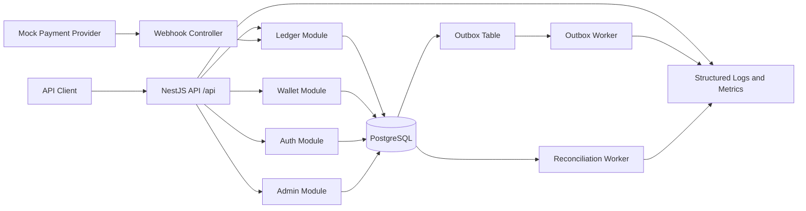
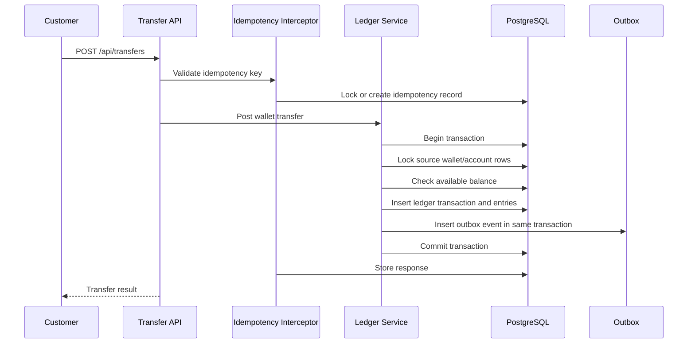
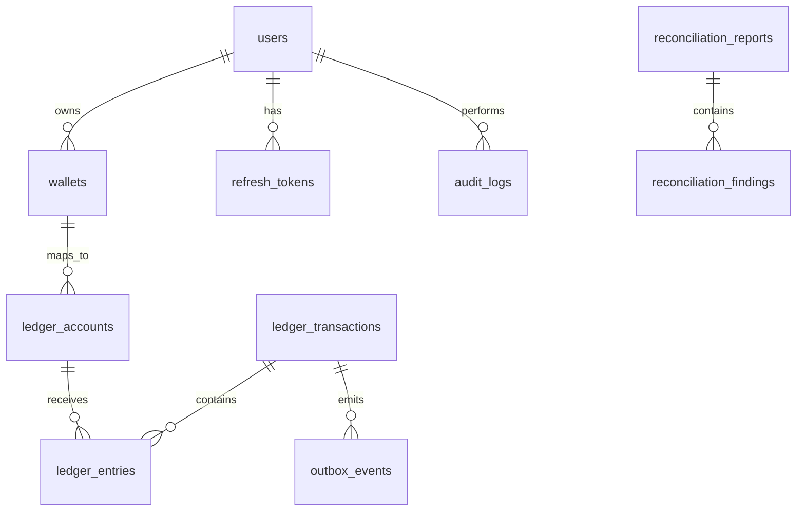
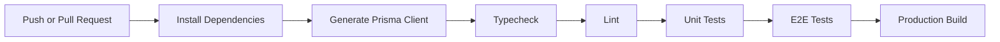

# LedgerCore

## Product Requirements Document (PRD) | Software Requirements Specification (SRS) | Engineering Blueprint

**Version:** 1.0  
**Date:** August 2026  
**Classification:** Backend Engineering Delivery Document  
**Project Type:** Backend-only advanced intermediate fintech ledger and wallet platform  
**Primary Stack:** NestJS, TypeScript, PostgreSQL, Prisma, Docker, Jest, Supertest

---

## Table of Contents

1. [Executive Summary](#1-executive-summary)
2. [Product Vision and Strategy](#2-product-vision-and-strategy)
3. [Market and Industry Context](#3-market-and-industry-context)
4. [User Personas and Stakeholders](#4-user-personas-and-stakeholders)
5. [Functional Requirements](#5-functional-requirements)
6. [Non-Functional Requirements](#6-non-functional-requirements)
7. [System Architecture Blueprint](#7-system-architecture-blueprint)
8. [Data Architecture and Schema](#8-data-architecture-and-schema)
9. [API Specification](#9-api-specification)
10. [Backend Operations Experience](#10-backend-operations-experience)
11. [Security Architecture](#11-security-architecture)
12. [Performance and Scalability Engineering](#12-performance-and-scalability-engineering)
13. [Edge Cases and Failure Mode Analysis](#13-edge-cases-and-failure-mode-analysis)
14. [Testing Strategy and QA](#14-testing-strategy-and-qa)
15. [Deployment and DevOps Architecture](#15-deployment-and-devops-architecture)
16. [Monitoring, Observability, and Alerting](#16-monitoring-observability-and-alerting)
17. [Compliance, Legal, and Regulatory Considerations](#17-compliance-legal-and-regulatory-considerations)
18. [Risk Assessment and Mitigation](#18-risk-assessment-and-mitigation)
19. [Project Timeline and Milestones](#19-project-timeline-and-milestones)
20. [Cost and Resource Planning](#20-cost-and-resource-planning)
21. [Appendices](#21-appendices)

---

# 1. Executive Summary

LedgerCore is a backend-only digital wallet and double-entry ledger engine designed to demonstrate production-grade financial transaction engineering. It supports authenticated users, wallet creation, deposits through signed provider webhooks, wallet-to-wallet transfers, transaction reversal, immutable ledger entries, audit logging, reconciliation, idempotency, concurrency control, background workers, and operational observability.

The project is intentionally focused on the backend systems that matter in fintech: correctness, atomicity, immutability, recoverability, and clear operational behavior under failure. Unlike a simple CRUD wallet service, LedgerCore treats money movement as an accounting problem first and an API problem second.

## 1.1 Business Problem

Most beginner wallet systems update a balance field directly. That approach is unsafe for financial systems because it makes it difficult to answer important questions:

| Question | Why It Matters |
|---|---|
| How did this balance get here? | Required for support, audit, reconciliation, and dispute handling. |
| Can two concurrent transfers overspend the same wallet? | Prevents negative balances and financial loss. |
| Can the same request be retried safely? | Required for mobile networks, payment providers, and distributed systems. |
| Can external webhook delivery be duplicated? | Payment providers routinely retry events. |
| Can a bad transaction be reversed without deleting history? | Financial systems must preserve a permanent trail. |

LedgerCore solves these concerns with an immutable double-entry ledger, idempotency records, row-level locking, transactional outbox processing, reconciliation workers, and structured audit logs.

## 1.2 Product Summary

| Capability | Description |
|---|---|
| Authentication | Register, login, refresh token rotation, logout, secure password hashing. |
| Authorization | Role-based access for customer, support, finance operations, and admin users. |
| Wallet Management | Create, view, freeze, close, and inspect wallets. |
| Deposits | Process mock payment provider webhooks with HMAC verification. |
| Transfers | Move funds between wallets using double-entry postings. |
| Ledger Engine | Enforce balanced debit and credit entries per currency. |
| Reversals | Reverse posted transactions using new compensating entries. |
| Idempotency | Safely retry mutating HTTP requests without duplicate side effects. |
| Concurrency Control | Prevent overspending using PostgreSQL transactions and locks. |
| Outbox Pattern | Publish side effects reliably after database commits. |
| Reconciliation | Detect ledger drift, imbalance, duplicate references, and stale events. |
| Audit Logging | Preserve administrative and security-sensitive actions. |
| Observability | Provide health checks, structured logs, metrics, and operational traces. |

## 1.3 Success Criteria

| ID | Success Criterion | Target |
|---|---|---|
| SC-001 | Double-entry invariant enforced | 100% of posted ledger transactions balance by currency. |
| SC-002 | Concurrent transfer safety | No overspend under high parallel request load. |
| SC-003 | Idempotent retries | Duplicate mutating requests return stable original result. |
| SC-004 | Webhook safety | Duplicate provider events do not create duplicate ledger postings. |
| SC-005 | Auditability | Every privileged or money-moving action has traceable metadata. |
| SC-006 | Test confidence | Unit, integration, e2e, and concurrency suites pass. |
| SC-007 | Deployment readiness | Dockerized application and PostgreSQL environment run locally. |

---

# 2. Product Vision and Strategy

## 2.1 Vision Statement

LedgerCore will be a compact but serious fintech backend that proves the developer can design, implement, test, and explain a financial ledger system from first principles through production-readiness.

## 2.2 Strategic Goals

| Goal | Description |
|---|---|
| Build a correct money engine | Prioritize ledger invariants over surface-level API breadth. |
| Demonstrate production architecture | Include workers, outbox, reconciliation, observability, and deployment. |
| Show advanced backend judgment | Use PostgreSQL transactions, locks, constraints, and idempotency deliberately. |
| Remain portfolio-friendly | Keep scope realistic enough to finish and explain in interviews. |
| Avoid frontend distraction | Focus entirely on backend design and correctness. |

## 2.3 Product Principles

1. Money movement is immutable.
2. Balances are derived from ledger entries, not trusted blindly.
3. Every external request may be duplicated.
4. Every background job may fail halfway.
5. Every privileged action must be auditable.
6. Every financial correction must be compensating, never destructive.
7. The database is the source of truth.

## 2.4 Scope

| Area | Included |
|---|---|
| Backend API | REST API under `/api`. |
| Database | PostgreSQL schema, migrations, indexes, constraints. |
| Ledger | Double-entry ledger accounts, transactions, and entries. |
| Wallets | User wallets, balance views, lifecycle state. |
| Auth | JWT access tokens, refresh tokens, secure password hashing. |
| Admin | Reversals, wallet status management, operational views. |
| Workers | Outbox dispatch and reconciliation. |
| Tests | Unit, e2e, and concurrency tests. |
| DevOps | Docker Compose, CI, linting, type checks, build. |

## 2.5 Out of Scope

| Area | Reason |
|---|---|
| Real card acquiring | Requires regulated provider integration and compliance scope. |
| Mobile or web frontend | Project is backend-only by design. |
| KYC/AML vendor integration | Documented for roadmap, not required for the core ledger proof. |
| Multi-region active-active ledger | Too broad for the current project level. |
| Real bank settlement | Mock provider and reconciliation are sufficient for portfolio scope. |

---

# 3. Market and Industry Context

Digital wallet platforms, payment processors, embedded finance providers, marketplace payout systems, and internal accounting platforms all need reliable ledgers. The hard part is not accepting an HTTP request; it is guaranteeing financial correctness across retries, race conditions, delayed providers, worker crashes, and administrative corrections.

| System Type | Relevant Similarities |
|---|---|
| Stripe Treasury-style ledgers | Immutable entries, transfer records, reconciliation, idempotency. |
| Marketplace wallet systems | User balances, deposits, internal transfers, withdrawals. |
| Banking core ledgers | Account-based postings, auditability, corrections. |
| Payment processors | Webhooks, provider references, duplicate delivery handling. |
| Exchange internal ledgers | High-concurrency balance updates and strict audit trails. |

## 3.1 Portfolio Differentiation

| Topic | Portfolio Signal |
|---|---|
| Double-entry ledger | Shows accounting-aware backend design. |
| PostgreSQL locking | Shows practical concurrency control. |
| Idempotency | Shows distributed systems maturity. |
| Outbox pattern | Shows reliable side-effect handling. |
| Reconciliation | Shows operational and financial correctness thinking. |
| Reversal model | Shows immutable correction strategy. |
| Test infrastructure | Shows readiness beyond happy-path demos. |

---

# 4. User Personas and Stakeholders

## 4.1 Personas

| Persona | Goal | Permissions | Main Risk |
|---|---|---|---|
| Customer | Hold wallet balance, receive deposits, send transfers. | Read own wallets, create transfers, view own transactions. | Duplicate payments, failed transfer ambiguity, frozen wallet behavior. |
| Support Agent | Help users understand wallet and transaction state. | Read-only operational visibility. | Accidentally receiving money movement permissions. |
| Finance Operations | Investigate discrepancies and perform approved corrections. | View ledger reports, run reconciliation, reverse eligible transactions. | Incorrect reversal or unlogged correction. |
| Admin | Manage roles, wallet status, and operational controls. | Full privileged access. | Excessive privilege or unaudited state change. |
| Mock Payment Provider | Notify LedgerCore of successful deposits. | HMAC-authenticated webhook delivery. | Duplicate event delivery or tampered payload. |

## 4.2 Stakeholder Matrix

| Stakeholder | Interest | Success Metric |
|---|---|---|
| Engineering | Correct, maintainable backend architecture. | Tests pass and invariants are enforced. |
| Product | Clear wallet and transaction behavior. | User flows are predictable and documented. |
| Finance | Ledger integrity and reconciliation. | Reports identify discrepancies accurately. |
| Security | Auth, RBAC, webhook verification, secrets management. | No unauthorized money movement. |
| Operations | Debuggable incidents and worker recovery. | Logs, metrics, and retries expose system state. |

---

# 5. Functional Requirements

## 5.1 Authentication

| ID | Requirement | Priority | Acceptance Criteria |
|---|---|---|---|
| FR-AUTH-001 | Users can register with email and password. | P0 | Password is hashed using Argon2id or equivalent secure algorithm. |
| FR-AUTH-002 | Users can log in and receive access and refresh tokens. | P0 | Invalid credentials return 401 without leaking account state. |
| FR-AUTH-003 | Refresh tokens rotate on use. | P0 | Reusing a previous refresh token fails and may revoke token family. |
| FR-AUTH-004 | Users can log out. | P1 | Active refresh token is revoked. |
| FR-AUTH-005 | Protected routes require valid JWT access tokens. | P0 | Missing or invalid token returns 401. |

## 5.2 Authorization and RBAC

| ID | Requirement | Priority | Acceptance Criteria |
|---|---|---|---|
| FR-RBAC-001 | System supports customer, support, finance_ops, and admin roles. | P0 | Role is persisted and enforced at route level. |
| FR-RBAC-002 | Customers can access only their own wallets and transactions. | P0 | Cross-user access returns 403 or 404. |
| FR-RBAC-003 | Support users can inspect but not mutate financial state. | P1 | Mutating support requests are rejected. |
| FR-RBAC-004 | Finance operations users can run reconciliation and perform reversals. | P0 | Actions are audit logged. |
| FR-RBAC-005 | Admin users can manage wallet status and privileged operations. | P0 | All admin actions create audit records. |

## 5.3 Wallets

| ID | Requirement | Priority | Acceptance Criteria |
|---|---|---|---|
| FR-WAL-001 | Authenticated users can create wallets. | P0 | Wallet creation is idempotent and scoped to the user. |
| FR-WAL-002 | Wallets have unique stable references. | P0 | Public API uses wallet references instead of internal IDs. |
| FR-WAL-003 | Wallets support currency-specific balances. | P0 | Currency is validated and consistently stored. |
| FR-WAL-004 | Wallets can be active, frozen, or closed. | P0 | Frozen or closed wallets reject transfers according to policy. |
| FR-WAL-005 | Users can list and view wallet details. | P0 | Derived balance and metadata are returned. |

## 5.4 Deposits and Webhooks

| ID | Requirement | Priority | Acceptance Criteria |
|---|---|---|---|
| FR-DEP-001 | Mock provider can send deposit webhook events. | P0 | Endpoint accepts signed provider payloads. |
| FR-DEP-002 | Webhook signature is verified using HMAC. | P0 | Invalid signature returns unauthorized response. |
| FR-DEP-003 | Duplicate provider event does not duplicate deposit. | P0 | Provider event ID is unique and idempotent. |
| FR-DEP-004 | Deposit posts balanced ledger transaction. | P0 | Customer wallet account and provider clearing account entries balance. |
| FR-DEP-005 | System/webhook-created transactions allow null creator. | P0 | No invalid UUID is inserted for system-created deposits. |

## 5.5 Transfers

| ID | Requirement | Priority | Acceptance Criteria |
|---|---|---|---|
| FR-TRF-001 | Customer can transfer funds from own wallet to another wallet. | P0 | Source ownership and wallet statuses are validated. |
| FR-TRF-002 | Transfers must be double-entry postings. | P0 | Debit and credit entries balance by currency. |
| FR-TRF-003 | Transfers cannot overspend available balance. | P0 | Concurrent requests do not create negative available balance. |
| FR-TRF-004 | Transfers are idempotent. | P0 | Same idempotency key returns same response. |
| FR-TRF-005 | Transfer metadata is stored for support and audit. | P1 | Request reference, actor, wallet refs, amount, and timestamps are queryable. |

## 5.6 Ledger Engine

| ID | Requirement | Priority | Acceptance Criteria |
|---|---|---|---|
| FR-LED-001 | Ledger transactions are immutable once posted. | P0 | Updates or deletes are not used to correct money movement. |
| FR-LED-002 | Every posted transaction has at least two entries. | P0 | Single-sided postings are rejected. |
| FR-LED-003 | Debits equal credits for each currency. | P0 | Unbalanced postings fail atomically. |
| FR-LED-004 | Ledger accounts map to wallet and system accounts. | P0 | Each entry belongs to a valid ledger account. |
| FR-LED-005 | Transaction reference is unique where required. | P0 | Duplicate business references are rejected or idempotently returned. |

## 5.7 Reversals

| ID | Requirement | Priority | Acceptance Criteria |
|---|---|---|---|
| FR-REV-001 | Authorized users can reverse eligible transactions. | P0 | Reversal creates a new transaction with opposite entries. |
| FR-REV-002 | Original transaction remains immutable. | P0 | No original entries are edited or deleted. |
| FR-REV-003 | Reversal is atomic with audit and outbox events. | P0 | Posting, audit log, and outbox insert commit or roll back together. |
| FR-REV-004 | Transaction cannot be reversed twice. | P0 | Duplicate reversal attempt fails or returns existing reversal. |
| FR-REV-005 | Reversal reason is required. | P1 | Reason appears in audit and transaction metadata. |

## 5.8 Idempotency

| ID | Requirement | Priority | Acceptance Criteria |
|---|---|---|---|
| FR-IDEMP-001 | All mutating endpoints require idempotency where applicable. | P0 | POST money movement and wallet creation endpoints use idempotency interceptor. |
| FR-IDEMP-002 | Idempotency key is scoped to actor and route. | P0 | Same key on different endpoint does not collide incorrectly. |
| FR-IDEMP-003 | Same key with same payload returns cached result. | P0 | Retry response is stable. |
| FR-IDEMP-004 | Same key with different payload is rejected. | P0 | System returns conflict response. |
| FR-IDEMP-005 | In-progress duplicate requests are handled safely. | P0 | Race condition cannot execute duplicate mutation. |

## 5.9 Outbox, Reconciliation, and Audit

| ID | Requirement | Priority | Acceptance Criteria |
|---|---|---|---|
| FR-WRK-001 | Money movement creates outbox events transactionally. | P0 | Events are not published before database commit. |
| FR-WRK-002 | Outbox worker claims events atomically. | P0 | Multiple workers cannot process the same pending event concurrently. |
| FR-REC-001 | Reconciliation detects unbalanced transactions. | P0 | Findings identify transaction ID and imbalance details. |
| FR-REC-002 | Reconciliation detects wallet balance drift. | P0 | Stored or cached balance mismatches are reported. |
| FR-REC-003 | Reconciliation inserts structured finding rows. | P0 | Every violation has severity, resource type, resource ID, and details. |
| FR-AUD-001 | Privileged actions create audit logs. | P0 | Actor, action, resource, metadata, IP, and timestamp are stored. |
| FR-AUD-002 | Audit service supports transaction client injection. | P0 | Callers can log within the same database transaction. |

---

# 6. Non-Functional Requirements

| Category | ID | Requirement | Target |
|---|---|---|---|
| Reliability | NFR-REL-001 | API must maintain ledger consistency during partial failures. | No committed unbalanced transaction. |
| Reliability | NFR-REL-002 | Worker crash must not lose outbox events. | Pending or processing events remain recoverable. |
| Security | NFR-SEC-001 | Passwords are never stored in plaintext. | Argon2id hash only. |
| Security | NFR-SEC-002 | JWT and webhook secrets are environment-managed. | No committed production secrets. |
| Security | NFR-SEC-003 | Authorization is enforced at route and service boundaries. | No cross-tenant access. |
| Performance | NFR-PERF-001 | Wallet balance lookup should be indexed and efficient. | P95 under 200ms locally under moderate load. |
| Performance | NFR-PERF-002 | Transfers should complete with transactional safety. | P95 under 500ms locally under moderate concurrency. |
| Maintainability | NFR-MAINT-001 | Modules follow NestJS boundaries. | Auth, wallets, ledger, webhooks, admin, audit separated. |
| Maintainability | NFR-MAINT-002 | API DTOs are validated. | Invalid payloads fail before service execution. |
| Observability | NFR-OBS-001 | Structured logs include correlation IDs. | Request and worker logs can be connected. |
| Observability | NFR-OBS-002 | Health endpoint exposes readiness state. | Database connectivity included. |

---

# 7. System Architecture Blueprint

LedgerCore uses a modular monolith architecture. The monolith keeps transaction boundaries simple while still separating domains clearly through NestJS modules. PostgreSQL is the source of truth. Workers run as background processes or scheduled services that operate against the same database.



## 7.1 Module Responsibilities

| Module | Responsibility |
|---|---|
| AuthModule | Registration, login, token refresh, logout, password hashing. |
| UsersModule | User persistence, profile data, role assignment. |
| WalletsModule | Wallet lifecycle, wallet ownership, wallet views. |
| LedgerModule | Posting engine, entries, account mapping, balance derivation. |
| TransfersModule | Wallet-to-wallet transfer orchestration. |
| WebhooksModule | Provider webhook validation and deposit processing. |
| AdminModule | Reversals, wallet status updates, operational endpoints. |
| AuditModule | Structured audit log creation. |
| IdempotencyModule | Idempotency decorators, interceptor, persistence. |
| ReconciliationModule | Report generation and findings. |
| Workers | Outbox dispatch and reconciliation scheduling. |
| ObservabilityModule | Health, logs, metrics, correlation IDs. |

## 7.2 Transfer Flow



## 7.3 Architectural Decisions

| Decision | Rationale |
|---|---|
| Modular monolith | Keeps portfolio scope finishable while preserving domain separation. |
| PostgreSQL as source of truth | Strong consistency, transactions, row locks, constraints. |
| Double-entry ledger | Required for auditability and financial correctness. |
| REST API | Simple, inspectable, testable backend interface. |
| Transactional outbox | Reliable side effects without distributed transactions. |
| Background workers | Separates retryable operational work from request lifecycle. |
| Raw SQL for critical locks | Ensures precise PostgreSQL concurrency behavior where ORM abstraction is insufficient. |

---

# 8. Data Architecture and Schema



## 8.1 Table Summary

| Table | Purpose |
|---|---|
| users | Stores account identity, role, password hash, and lifecycle state. |
| refresh_tokens | Stores rotated refresh token hashes and revocation state. |
| wallets | Stores wallet reference, owner, currency, and status. |
| ledger_accounts | Maps wallet and system accounts into the ledger. |
| ledger_transactions | Stores immutable transaction headers and business references. |
| ledger_entries | Stores immutable debit and credit rows. |
| idempotency_keys | Stores request fingerprint, response, and processing status. |
| provider_events | Stores webhook events and provider references. |
| outbox_events | Stores reliable side-effect events. |
| audit_logs | Stores privileged and sensitive action trail. |
| reconciliation_reports | Stores reconciliation run summary. |
| reconciliation_findings | Stores structured violations detected by reconciliation. |

## 8.2 Key Constraints and Indexes

| Constraint or Index | Purpose |
|---|---|
| unique(users.email) | Prevent duplicate accounts. |
| unique(wallets.wallet_ref) | Stable public wallet lookup. |
| index(wallets.user_id, status) | Owner wallet queries. |
| unique(ledger_transactions.transaction_ref) | Stable transaction lookup. |
| index(ledger_entries.ledger_account_id, created_at) | Balance derivation and history. |
| unique(provider_events.provider, provider_event_id) | Webhook duplicate prevention. |
| unique(idempotency_keys.actor_id, route, key) | Retry safety by actor and operation. |
| index(outbox_events.status, available_at, created_at) | Worker claim performance. |
| index(audit_logs.actor_id, created_at) | Audit investigation. |

## 8.3 Important Field Rules

| Entity | Rule |
|---|---|
| ledger_transactions.created_by | Nullable for system/webhook transactions. Never insert string values into UUID fields. |
| ledger_entries.amount_minor | Positive integer minor units only. |
| wallets.currency | Uppercase three-letter currency code. |
| idempotency_keys.request_hash | Stable hash of method, path, actor, and payload. |
| reconciliation_findings.details | JSON object containing machine-readable violation details. |

## 8.4 Core Invariants

1. Every posted transaction has at least two entries.
2. Debits equal credits per transaction and currency.
3. Ledger entries are immutable.
4. Reversals create new compensating transactions.
5. Duplicate idempotent requests do not duplicate side effects.
6. Duplicate provider webhooks do not duplicate ledger postings.
7. Concurrent transfers cannot overspend a wallet.
8. Outbox events are created in the same transaction as the state change they describe.
9. Reconciliation findings are stored for every detected integrity violation.
10. Privileged actions are audit logged.

---

# 9. API Specification

## 9.1 API Conventions

| Convention | Standard |
|---|---|
| Global prefix | `/api` |
| Format | JSON |
| Authentication | Bearer JWT for protected endpoints |
| Idempotency | `Idempotency-Key` header for mutating endpoints |
| Error shape | Stable code, message, details, requestId |
| Amounts | Minor units as integers, never floats |
| Currency | Uppercase three-letter currency code |

## 9.2 Standard Error Response

```json
{
  "error": {
    "code": "INSUFFICIENT_FUNDS",
    "message": "Source wallet has insufficient available balance.",
    "details": {
      "walletRef": "wal_123"
    },
    "requestId": "req_abc"
  }
}
```

## 9.3 Endpoint Catalogue

| Method | Path | Description | Auth | Idempotent |
|---|---|---|---|---|
| POST | `/api/auth/register` | Register user. | Public | No |
| POST | `/api/auth/login` | Login user. | Public | No |
| POST | `/api/auth/refresh` | Rotate refresh token. | Refresh | No |
| POST | `/api/auth/logout` | Logout current session. | Bearer | No |
| GET | `/api/auth/me` | Get current user. | Bearer | No |
| POST | `/api/wallets` | Create wallet. | Customer/Admin | Yes |
| GET | `/api/wallets` | List own wallets. | Customer | No |
| GET | `/api/wallets/:walletRef` | Get wallet details. | Owner/Privileged | No |
| POST | `/api/transfers` | Transfer funds between wallets. | Customer/Admin | Yes |
| GET | `/api/transfers/:transactionRef` | Get transfer detail. | Owner/Privileged | No |
| POST | `/api/webhooks/mock-provider/deposits` | Receive signed deposit webhook. | HMAC | Provider event ID |
| PATCH | `/api/admin/wallets/:walletRef/status` | Update wallet status. | Admin | Yes |
| POST | `/api/admin/ledger-transactions/:transactionRef/reverse` | Reverse transaction. | finance_ops/admin | Yes |
| GET | `/api/admin/reconciliation/reports` | List reconciliation reports. | finance_ops/admin | No |
| POST | `/api/admin/reconciliation/run` | Start reconciliation. | finance_ops/admin | Yes |
| GET | `/api/admin/audit-logs` | Query audit logs. | support/admin | No |

## 9.4 Sample Payloads

### Create Wallet

```json
{
  "currency": "USD"
}
```

### Transfer

```json
{
  "sourceWalletRef": "wal_source",
  "destinationWalletRef": "wal_dest",
  "amountMinor": 2500,
  "currency": "USD",
  "description": "Payment"
}
```

### Deposit Webhook

```json
{
  "eventId": "evt_provider_123",
  "walletRef": "wal_01H...",
  "amountMinor": 5000,
  "currency": "USD",
  "providerReference": "pay_123",
  "occurredAt": "2026-08-10T00:00:00.000Z"
}
```

### Reversal

```json
{
  "reason": "Customer dispute approved by finance operations."
}
```

---

# 10. Backend Operations Experience

LedgerCore has no frontend, but the backend still needs a strong operator and developer experience.

## 10.1 Developer Workflows

| Workflow | Command |
|---|---|
| Install dependencies | `npm install` |
| Start local infrastructure | `docker compose up -d` |
| Run migrations | `npx prisma migrate dev` |
| Start API | `npm run start:dev` |
| Run unit tests | `npm test` |
| Run e2e tests | `npm run test:e2e` |
| Run concurrency tests | `npm run test:concurrency` |
| Lint | `npm run lint` |
| Typecheck | `npm run typecheck` |
| Build | `npm run build` |

## 10.2 Demo Flow

1. Register two users.
2. Login as user A and user B.
3. Create one wallet for each user.
4. Send signed mock deposit webhook to user A wallet.
5. Verify user A wallet balance.
6. Transfer part of the balance from user A to user B.
7. Retry the same transfer request with the same idempotency key.
8. Attempt concurrent overspend and show only valid transfers succeed.
9. Reverse a transaction as finance operations.
10. Run reconciliation and inspect reports and findings.

---

# 11. Security Architecture

| Control Area | Requirement |
|---|---|
| Password hashing | Passwords are hashed using Argon2id or equivalent secure password hashing. |
| JWT access tokens | Short-lived signed access tokens protect API routes. |
| Refresh tokens | Refresh tokens are stored hashed, rotated on use, and revocable. |
| RBAC | Role guards enforce customer, support, finance_ops, and admin permissions. |
| Ownership | Customer access is scoped to owned wallets and transactions. |
| Webhook HMAC | Provider payloads must be signed over raw body. |
| Replay defense | Provider event IDs are unique; timestamp tolerance is recommended. |
| Audit redaction | Sensitive fields are omitted or redacted from audit metadata. |
| Secrets | Environment variables hold secrets; `.env.example` documents names only. |

---

# 12. Performance and Scalability Engineering

## 12.1 Performance Targets

| Operation | Target |
|---|---|
| Login | P95 under 300ms excluding hash cost variation. |
| Wallet lookup | P95 under 200ms locally. |
| Deposit webhook | P95 under 500ms locally. |
| Transfer | P95 under 500ms locally under moderate concurrency. |
| Reconciliation run | Completes within acceptable batch window for local dataset. |

## 12.2 Concurrency Strategy

| Problem | Control |
|---|---|
| Two transfers spend same wallet | Lock wallet/account rows before balance check and posting. |
| Duplicate HTTP retry | Idempotency key row with unique scope and processing state. |
| Duplicate webhook | Provider event unique constraint. |
| Duplicate worker claim | Atomic `UPDATE ... WHERE id IN (SELECT ... FOR UPDATE SKIP LOCKED) RETURNING ...`. |
| Reversal race | Unique reversal relation or transaction lock on original transaction. |

## 12.3 Scaling Path

| Stage | Approach |
|---|---|
| Local portfolio | Single API process, one PostgreSQL instance, worker process. |
| Small production | Multiple API replicas, one primary PostgreSQL, worker replicas. |
| Growth | Read replicas for reporting, partition ledger entries by time/currency. |
| Large scale | Dedicated ledger service, event streaming, archival stores, stronger operational controls. |

---

# 13. Edge Cases and Failure Mode Analysis

| Area | Case | Expected Behavior |
|---|---|---|
| Wallet | Create duplicate wallet with same idempotency key. | Return original wallet response. |
| Wallet | Access another user's wallet. | Reject with 403 or resource-safe 404. |
| Wallet | Transfer from frozen or closed wallet. | Reject. |
| Transfer | Amount is zero or negative. | Reject validation. |
| Transfer | Amount exceeds balance. | Reject with insufficient funds. |
| Transfer | Source equals destination. | Reject unless explicit no-op policy exists. |
| Transfer | Same idempotency key, different payload. | Reject conflict. |
| Transfer | Concurrent overspend. | Only transactions with available funds succeed. |
| Webhook | Invalid or missing HMAC. | Reject. |
| Webhook | Duplicate provider event. | Do not repost ledger transaction. |
| Webhook | Unknown wallet. | Reject or store failed event according to provider contract. |
| Worker | Worker crashes after claiming event. | Event can be retried after timeout or failure handling. |
| Worker | Two workers claim simultaneously. | Atomic query prevents same event claim. |
| Reconciliation | Unbalanced transaction found. | Finding with high or critical severity. |
| Reconciliation | Balance drift found. | Finding links wallet/account and computed difference. |

---

# 14. Testing Strategy and QA

## 14.1 Test Pyramid

| Layer | Purpose | Examples |
|---|---|---|
| Unit | Validate pure business rules and service behavior. | Amount validation, role policy, hash comparison. |
| Integration | Validate database-backed services. | Ledger posting, idempotency persistence, webhook event insert. |
| E2E | Validate full HTTP flows. | Register, login, wallet, deposit, transfer, reversal. |
| Concurrency | Validate race safety. | Parallel transfer overspend, duplicate idempotent requests. |
| Worker | Validate retry and claim behavior. | Outbox atomic claim, failure attempts, reconciliation findings. |

## 14.2 Critical Test Scenarios

| ID | Scenario | Expected Result |
|---|---|---|
| TEST-001 | Register and login user. | Tokens returned and protected route works. |
| TEST-002 | Create wallet with idempotency key twice. | One wallet created, same response returned. |
| TEST-003 | Deposit webhook with valid signature. | Balance increases and ledger balances. |
| TEST-004 | Deposit webhook duplicate event. | No duplicate balance increase. |
| TEST-005 | Transfer between wallets. | Source decreases, destination increases, ledger balances. |
| TEST-006 | Transfer same idempotency key twice. | One transfer posted. |
| TEST-007 | Concurrent overspend. | No negative balance; excess requests fail. |
| TEST-008 | Reverse transfer. | Reversal entries offset original transaction. |
| TEST-009 | Outbox worker with two workers. | No duplicate processing. |
| TEST-010 | Reconciliation with injected imbalance. | Finding row created. |

## 14.3 Required Verification Commands

```bash
npm run typecheck
npm run lint
npm test
npm run test:e2e
npm run test:concurrency
npm run build
```

---

# 15. Deployment and DevOps Architecture

## 15.1 Local Deployment

| Component | Tool |
|---|---|
| API | Node.js/NestJS |
| Database | PostgreSQL via Docker Compose |
| ORM | Prisma migrations and generated client |
| Workers | Node worker process or Nest command entry |
| Tests | Jest and Supertest |

## 15.2 Environment Variables

| Variable | Purpose |
|---|---|
| `DATABASE_URL` | PostgreSQL connection string. |
| `JWT_ACCESS_SECRET` | Access token signing secret. |
| `JWT_REFRESH_SECRET` | Refresh token signing secret or token secret material. |
| `WEBHOOK_SECRET` | HMAC secret for mock provider. |
| `NODE_ENV` | Runtime environment. |
| `PORT` | API port. |
| `LOG_LEVEL` | Logging verbosity. |

## 15.3 CI Pipeline



---

# 16. Monitoring, Observability, and Alerting

## 16.1 Logs

| Event | Required Fields |
|---|---|
| API request | requestId, method, path, actorId, status, duration. |
| Transfer posted | transactionRef, sourceWalletRef, destinationWalletRef, amountMinor, currency. |
| Deposit processed | providerEventId, walletRef, amountMinor, currency. |
| Reversal posted | originalTransactionRef, reversalTransactionRef, actorId, reason. |
| Worker event processed | eventId, eventType, status, attempts. |
| Reconciliation finding | reportId, findingType, severity, resourceId. |

## 16.2 Metrics

| Metric | Type | Purpose |
|---|---|---|
| `api_requests_total` | Counter | Request volume by route and status. |
| `api_request_duration_ms` | Histogram | Latency tracking. |
| `ledger_transactions_total` | Counter | Posted transactions by type. |
| `ledger_post_failures_total` | Counter | Failed posting attempts. |
| `idempotency_replays_total` | Counter | Retry behavior. |
| `outbox_pending_total` | Gauge | Worker backlog. |
| `outbox_failures_total` | Counter | Failed side effects. |
| `reconciliation_findings_total` | Counter | Integrity findings by severity. |

## 16.3 Alerts

| Alert | Condition |
|---|---|
| Ledger imbalance | Any critical reconciliation finding. |
| Outbox backlog high | Pending events exceed threshold for sustained period. |
| Worker failure spike | Failed attempts exceed threshold. |
| Auth failure spike | Login failures spike by IP or account. |
| API error rate high | 5xx rate exceeds threshold. |

---

# 17. Compliance, Legal, and Regulatory Considerations

LedgerCore is a portfolio and learning system, not a regulated production payment platform. However, its architecture should reflect awareness of fintech compliance concerns.

| Area | Relevance |
|---|---|
| Auditability | Required for financial investigation and governance. |
| Data minimization | Avoid storing unnecessary sensitive data. |
| Immutability | Ledger entries should preserve historical truth. |
| Access control | Financial data requires least-privilege access. |
| Reconciliation | Required for financial operations and accounting controls. |
| Incident response | Operational logs and reports support investigation. |

## 17.1 Future Compliance Roadmap

| Capability | Future Requirement |
|---|---|
| KYC | Identity verification before high-value wallet activity. |
| AML | Transaction monitoring and suspicious activity workflows. |
| PCI DSS | Required if handling card data directly. |
| SOC 2 | Controls for security, availability, and confidentiality. |
| GDPR/Privacy | Data rights, retention, and deletion policies where legally allowed. |
| Financial reporting | Exportable ledger reports and settlement files. |

---

# 18. Risk Assessment and Mitigation

## 18.1 Risk Register

| ID | Risk | Severity | Likelihood | Mitigation |
|---|---|---|---|---|
| R-001 | Ledger transaction can be posted unbalanced. | Critical | Low | Service-level validation plus reconciliation checks and database constraints where possible. |
| R-002 | Concurrent transfers overspend wallet. | Critical | Medium | Row-level locking and concurrency tests. |
| R-003 | Duplicate webhook creates duplicate deposit. | Critical | Medium | Unique provider event IDs and atomic processing. |
| R-004 | Idempotency gap on mutating endpoint. | High | Medium | Decorator/interceptor audit and e2e tests. |
| R-005 | Reversal audit/outbox outside transaction. | High | Medium | Pass transaction client through audit and outbox insert. |
| R-006 | Outbox worker double-claims event. | High | Medium | Atomic update-returning claim query. |
| R-007 | Reconciliation reports summary but omits findings. | Medium | Medium | Insert structured finding for every violation. |
| R-008 | Tests diverge from real API prefix or DTOs. | Medium | Medium | Shared test app setup and DTO-aligned fixtures. |
| R-009 | Secrets committed to repository. | High | Low | `.env.example`, secret scanning, no real secrets. |
| R-010 | Scope expands beyond finishable portfolio project. | Medium | Medium | Keep roadmap separate from MVP. |

## 18.2 Finish-Readiness Blockers

| Blocker | Required Fix |
|---|---|
| Webhook deposit UUID mismatch | System/webhook transactions must omit `createdBy` or store null creator. |
| Missing idempotency on wallet creation | Add idempotency decorator/interceptor to `POST /wallets`. |
| Non-atomic reversal/audit/outbox | Put reversal posting, outbox insert, and audit log in one transaction. |
| Non-atomic outbox claim | Use atomic update with `FOR UPDATE SKIP LOCKED` subquery and `RETURNING`. |
| Reconciliation findings omission | Insert finding rows for every detected violation. |
| E2E/concurrency infrastructure mismatch | Align global prefix, helpers, imports, and DTO payloads. |
| ESLint/type errors | Fix until typecheck, lint, tests, and build pass. |

---

# 19. Project Timeline and Milestones

| Phase | Duration | Deliverables |
|---|---|---|
| Phase 1: Foundation | 2-3 days | NestJS setup, PostgreSQL, Prisma schema, Docker Compose, health check. |
| Phase 2: Auth and RBAC | 2-3 days | Register, login, refresh rotation, guards, roles. |
| Phase 3: Wallets and Ledger | 4-5 days | Wallet creation, ledger accounts, posting engine, derived balances. |
| Phase 4: Deposits and Transfers | 4-5 days | HMAC webhooks, deposits, transfers, idempotency, concurrency locks. |
| Phase 5: Admin and Reversals | 2-3 days | Reversal endpoint, audit logging, wallet status controls. |
| Phase 6: Workers and Reconciliation | 3-4 days | Outbox worker, reconciliation reports, findings. |
| Phase 7: Tests and Hardening | 4-6 days | Unit, e2e, concurrency tests, lint, typecheck, build. |
| Phase 8: Documentation and Demo | 2-3 days | README, architecture docs, demo script, final blueprint. |

## 19.1 Milestone Acceptance

| Milestone | Acceptance Criteria |
|---|---|
| M1 | App boots with `/api/health` and connects to PostgreSQL. |
| M2 | Auth flow works and RBAC guards protect routes. |
| M3 | Wallet creation and balance view work. |
| M4 | Deposits and transfers post balanced ledger entries. |
| M5 | Idempotency and concurrency tests pass. |
| M6 | Reversal is atomic with audit and outbox. |
| M7 | Workers and reconciliation produce expected records. |
| M8 | Full verification command suite passes. |

---

# 20. Cost and Resource Planning

## 20.1 Local Development Cost

| Resource | Cost |
|---|---|
| Node.js runtime | Free |
| PostgreSQL local Docker container | Free |
| Prisma | Free for local development |
| GitHub Actions public minutes | Often free within limits |
| Hosting for portfolio demo | Optional |

## 20.2 Production-Like Small Deployment Estimate

| Component | Monthly Estimate |
|---|---|
| Small API container | $5-$25 |
| Managed PostgreSQL starter instance | $15-$50 |
| Logs/metrics starter tier | $0-$25 |
| Domain and TLS | $1-$3 |
| Total rough range | $20-$100/month |

---

# 21. Appendices

## Appendix A: Glossary

| Term | Definition |
|---|---|
| Ledger | Immutable record of financial transactions and entries. |
| Ledger transaction | Header record representing one financial event. |
| Ledger entry | Debit or credit line within a ledger transaction. |
| Double-entry | Accounting model where every transaction has equal debits and credits. |
| Wallet | User-facing container for funds. |
| Idempotency | Ability to safely retry a request without duplicating side effects. |
| Outbox | Database table for reliable side effects after transaction commit. |
| Reconciliation | Process of comparing expected and actual financial state. |
| Reversal | Compensating transaction that offsets a previous posting. |
| HMAC | Hash-based message authentication code used for webhook signing. |

## Appendix B: Architecture Decision Records

### ADR-001: Use a Modular Monolith

**Decision:** Build LedgerCore as a modular NestJS monolith.  
**Reason:** Keeps transaction boundaries simple and implementation finishable while still demonstrating clean architecture.

### ADR-002: Use PostgreSQL for Financial State

**Decision:** PostgreSQL is the source of truth.  
**Reason:** It provides strong transactions, row locks, constraints, JSON metadata, and mature indexing.

### ADR-003: Use Double-Entry Ledger

**Decision:** All money movement must be represented by balanced debit and credit entries.  
**Reason:** Direct balance mutation is insufficient for auditability and correction.

### ADR-004: Use Idempotency Keys on Mutations

**Decision:** Mutating endpoints that create financial or durable state require idempotency keys.  
**Reason:** Clients, networks, and providers retry requests.

### ADR-005: Use Transactional Outbox

**Decision:** Side effects are represented as outbox events inserted in the same database transaction.  
**Reason:** Avoids publishing events for rolled-back database changes.

### ADR-006: Use Reversal Instead of Mutation

**Decision:** Corrections create compensating transactions.  
**Reason:** Financial history must remain inspectable and immutable.

## Appendix C: Interview Talking Points

| Topic | Strong Explanation |
|---|---|
| Why double-entry? | It makes every financial event auditable and self-balancing. |
| Why idempotency? | Retries are normal in distributed systems; duplicate execution is not acceptable for money. |
| Why row locks? | Balance checks and postings must be serialized for the affected wallet/account. |
| Why outbox? | Database commits and external side effects cannot be atomically coordinated otherwise. |
| Why reconciliation? | Even with good code, operations need independent checks for drift and anomalies. |
| Why reversals? | Financial systems correct history with new entries, not edits. |

## Appendix D: Resume Bullets

- Built a backend-only digital wallet and double-entry ledger engine using NestJS, TypeScript, PostgreSQL, and Prisma.
- Implemented immutable ledger transactions, balanced debit/credit postings, wallet transfers, deposits, and reversals.
- Designed idempotency middleware for retry-safe mutating APIs and duplicate webhook protection.
- Implemented PostgreSQL transaction and row-locking strategy to prevent concurrent wallet overspending.
- Built transactional outbox and reconciliation workers for reliable side effects and ledger integrity checks.
- Added RBAC, audit logging, HMAC webhook verification, structured errors, and production-style test suites.

## Appendix E: Final Definition of Done

LedgerCore is complete when:

1. The API runs under the `/api` global prefix.
2. Auth, RBAC, wallets, deposits, transfers, reversals, webhooks, outbox, audit, and reconciliation are implemented.
3. All mutating endpoints that create durable state enforce idempotency.
4. Ledger invariants are covered by tests.
5. Concurrent overspend tests pass.
6. Webhook duplicate tests pass.
7. Reversal atomicity is tested.
8. Outbox worker claim is atomic.
9. Reconciliation inserts structured findings.
10. `npm run typecheck`, `npm run lint`, `npm test`, `npm run test:e2e`, `npm run test:concurrency`, and `npm run build` pass.

---

**End of Document**
