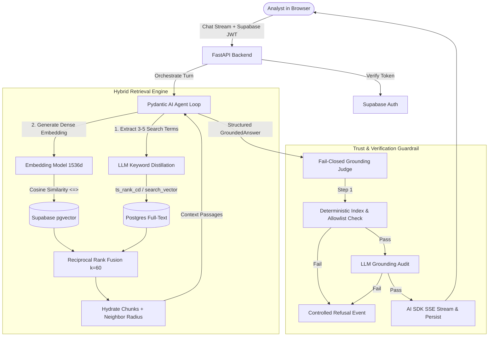

# Loom — Institutional SEC Research & Financial Copilot

[](https://fastapi.tiangolo.com)
[](https://react.dev)
[](https://www.typescriptlang.org)
[](https://supabase.com)
[](https://ai.pydantic.dev)
[](LICENSE)

**Loom** is an enterprise-grade AI research assistant engineered for equity research analysts and institutional portfolio managers. It ingests complex SEC 10-K and 10-Q annual filings, provides structure-aware table extraction, executes parallel hybrid retrieval (dense pgvector semantic search + full-text sparse search with Reciprocal Rank Fusion), runs an autonomous multi-step Pydantic AI agent, and strictly enforces a **fail-closed grounding validation guardrail**.

Every answer generated is accompanied by verifiable, single-click filing citation chips, neighboring context sheets, and interactive financial charts.

---

## 🏛️ System Architecture



---

## 🚀 Key Engineering Highlights

### 1. Hybrid Retrieval with Reciprocal Rank Fusion (RRF)
- **Dense Semantic Search**: Cosine distance ranking using `pgvector` HNSW indexing over 1536-dimensional embeddings.
- **Sparse Keyword Search**: Postgres full-text search (`tsvector`) indexed with GIN, driven by query-time LLM keyword distillation.
- **Reciprocal Rank Fusion**: Non-parametric rank aggregation ($Score = \sum \frac{1}{k + r}$) ensuring exact financial terms and conceptual queries match simultaneously.

### 2. Multi-Step Autonomous Agent (Pydantic AI)
- Fully typed tool loop (`search_filings`, `read_chunks`, `read_chunk`, `read_surrounding_chunks`).
- Bounded token windows (max 800-char excerpts and 12,000-char tool outputs) preventing context overflow.
- Dynamic `TurnRegistry` allowlisting every retrieved passage as a verifiable source for citations.

### 3. Fail-Closed Grounding Validator
- **Zero Hallucination Tolerance**: Eliminates ungrounded assertions. Every claim must map to a retrieved passage in the `TurnRegistry`.
- **Two-Tier Audit**: Cheap structural verification (contiguous `[n]` citation mapping, unique index checks) followed by an LLM grounding judge auditing verbatim excerpts.

### 4. Interactive Financial Visualizations & Trust UI
- Automatic parsing of financial tables and segment trends into interactive SVG Area, Bar, and Line charts.
- Single-click slide-over source passage sheet showing cited excerpts highlighted alongside preceding and succeeding chunks.
- "Export Research Memo" utility formatting synthesis, table data, and citations for institutional dissemination.

---

## 📦 Tech Stack

| Layer | Technology | Rationale |
|---|---|---|
| **Backend** | Python 3.12+, FastAPI, Uvicorn | High-performance async API with strict Pydantic v2 schemas |
| **Agent Engine** | Pydantic AI | Typed boundaries, dependency injection, bounded tools |
| **Database & Vector** | Supabase Postgres + `pgvector` | Unified relational data model with ACID guarantees and vector indexing |
| **Ingestion Pipeline** | Docling + Custom SEC Table Parser | High-fidelity financial table extraction and row-level chunking |
| **Frontend** | React 19, TypeScript, Vite, Tailwind CSS | Modern, reactive SPA with sub-second HMR and crisp typography |
| **UI System** | shadcn/ui, Lucide Icons, Geist Font | Institutional financial terminal aesthetic |

---

## 🛠️ Local Development & Quickstart

### Prerequisites
- Python 3.12+ with [`uv`](https://docs.astral.sh/uv/)
- Node.js 20+ with [`pnpm`](https://pnpm.io/)
- A [Supabase](https://supabase.com) project with `pgvector` enabled

### 1. Repository Setup
```bash
git clone https://github.com/Sajal-kanwal/loom.git
cd loom
```

### 2. Backend Setup
```bash
cd backend
cp .env.example .env
# Fill SUPABASE_URL, SUPABASE_ANON_KEY, SUPABASE_SERVICE_ROLE_KEY, DATABASE_URL, OPENAI_API_KEY / GEMINI_API_KEY
uv sync
uv run alembic upgrade head
```

Run backend server:
```bash
uv run uvicorn app.main:app --reload --port 8000
```

### 3. Frontend Setup
```bash
cd ../frontend
cp .env.example .env
pnpm install
pnpm dev
```

Visit `http://localhost:5173` to start researching filings.

---

## 🧪 Testing & Validation Suite

Run backend test suite:
```bash
cd backend
uv run pytest -m "not integration" --ignore=tests/ingest
uv run ruff check .
```

Run frontend build & typecheck:
```bash
cd frontend
pnpm build
pnpm lint
```

---

## 📄 License & Attribution

Licensed under the [MIT License](LICENSE). Developed by [Sajal Kanwal](https://github.com/Sajal-kanwal).
