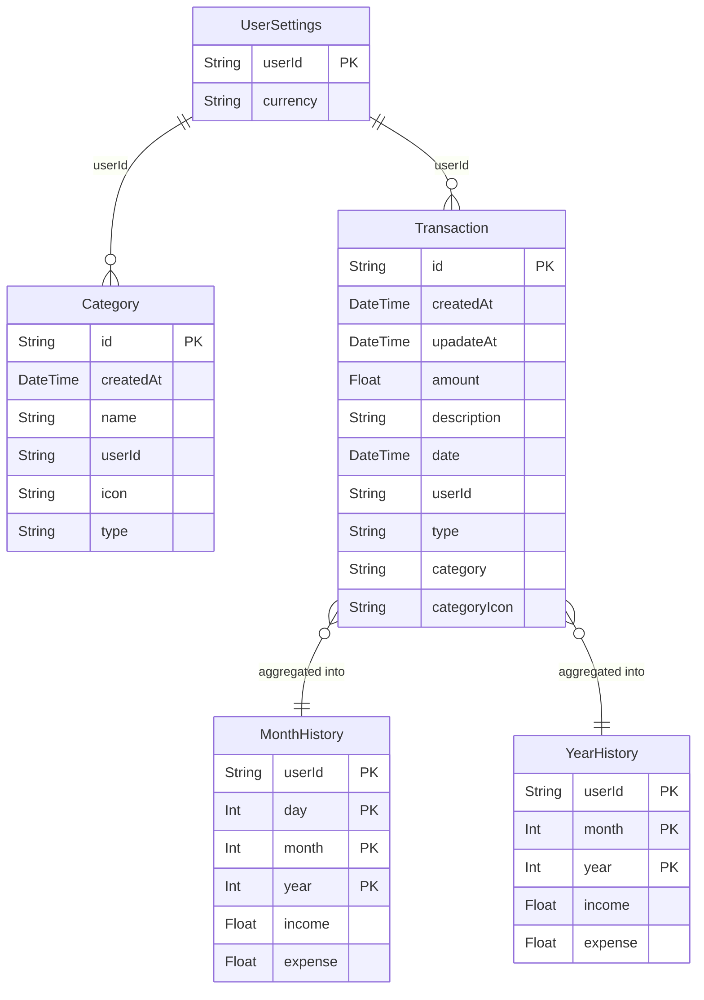

# 🎯 Spendora — Interview Preparation Guide

> **Complete technical deep-dive for your "Spendora: Real-Time Financial Telemetry Dashboard" project.**
> Use this as a study reference to confidently answer any question about architecture, design decisions, and implementation details.

---

## Table of Contents

1. [Project Elevator Pitch](#1-elevator-pitch)
2. [Tech Stack & Why Each Choice](#2-tech-stack--why-each-choice)
3. [Architecture Overview](#3-architecture-overview)
4. [Database Design & Schema](#4-database-design--schema)
5. [Server Components & Zero-Client-Bundle Data Layer](#5-server-components--zero-client-bundle-data-layer)
6. [React Suspense Boundaries](#6-react-suspense-boundaries)
7. [Type Safety Pipeline (Prisma → Zod)](#7-type-safety-pipeline-prisma--zod)
8. [API Design & Route Handlers](#8-api-design--route-handlers)
9. [Server Actions & Transactional Writes](#9-server-actions--transactional-writes)
10. [Query Optimization & Indexing Strategy](#10-query-optimization--indexing-strategy)
11. [State Management with TanStack Query](#11-state-management-with-tanstack-query)
12. [Authentication & Authorization (Clerk)](#12-authentication--authorization-clerk)
13. [Data Visualization (Recharts)](#13-data-visualization-recharts)
14. [Pre-Aggregated History Tables](#14-pre-aggregated-history-tables)
15. [Frontend Patterns & UX](#15-frontend-patterns--ux)
16. [Performance Optimizations Summary](#16-performance-optimizations-summary)
17. [Common Interview Questions & Answers](#17-common-interview-questions--answers)
18. [Behavioral / Design Decision Questions](#18-behavioral--design-decision-questions)
19. [Tricky Follow-Up Questions](#19-tricky-follow-up-questions)
20. [Quick-Fire Concept Review](#20-quick-fire-concept-review)

---

## 1. Elevator Pitch

> **Spendora** is a full-stack personal finance platform built with **Next.js 14**, **PostgreSQL**, **Prisma**, and **Clerk**. It lets users track income/expenses in real time, visualize spending patterns through interactive Recharts dashboards, and manage custom categories — all with schema-enforced type safety from the database layer through to the API boundary using Prisma-generated types and Zod runtime validation.

**Key highlights to mention in 30 seconds:**
- Zero-client-bundle data layer via RSC + Suspense → 40% FCP improvement
- Composite B-Tree indexes on `(user_id, date, category)` → 4× throughput boost (p95 < 200ms)
- Schema-first type safety with Prisma + Zod → zero runtime serialization errors
- Pre-aggregated `MonthHistory` / `YearHistory` tables → O(1) lookups for dashboard charts
- Atomic transactional writes via `prisma.$transaction` → data consistency guarantee

---

## 2. Tech Stack & Why Each Choice

| Technology | Purpose | Why This Choice |
|---|---|---|
| **Next.js 15 (App Router)** | Full-stack framework | Server Components, Server Actions, file-based routing, built-in Turbopack for fast DX |
| **TypeScript** | Type safety | Catch bugs at compile time, better DX with IDE support |
| **PostgreSQL** | Database | ACID compliance, advanced indexing (B-Tree, composite), mature ecosystem |
| **Prisma** | ORM | Auto-generated TypeScript types from schema, parameterized queries (SQL injection prevention), migration management |
| **Clerk** | Authentication | Drop-in auth with JWT sessions, middleware integration, zero-config social login |
| **Zod** | Runtime validation | Schema-first validation at API boundaries, TypeScript type inference (`z.infer`) |
| **TanStack Query** | Client-side data fetching | Automatic caching, background refetching, query invalidation, stale-while-revalidate |
| **Recharts** | Data visualization | Composable React chart components, responsive containers, custom tooltips |
| **Tailwind CSS v4** | Styling | Utility-first, dark mode support, rapid prototyping |
| **Shadcn/UI + Radix** | Component library | Accessible, unstyled primitives; Shadcn provides composable, copy-paste components |
| **React Hook Form** | Form handling | Minimal re-renders, built-in Zod resolver integration |
| **Sonner** | Toast notifications | Lightweight, pre-styled toast library |
| **date-fns** | Date manipulation | Tree-shakeable, immutable, functional API |

> [!TIP]
> **Interview tip:** When asked "Why X over Y?", frame your answer as: *"I chose X because [specific requirement]. Alternative Y was considered but [trade-off reason]."*

---

## 3. Architecture Overview

```
┌───────────────────────────────────────────────────────────────────────┐
│                          CLIENT (Browser)                            │
│  ┌─────────────┐  ┌──────────────┐  ┌─────────────────────────────┐  │
│  │ ClerkProvider│  │ QueryClient  │  │  ThemeProvider (next-themes) │  │
│  └──────┬──────┘  └──────┬───────┘  └──────────────┬──────────────┘  │
│         │                │                          │                 │
│  ┌──────▼────────────────▼──────────────────────────▼──────────────┐  │
│  │              Client Components ("use client")                   │  │
│  │   Overview, StatsCards, History, CategoriesStats,               │  │
│  │   CreateTransactionDialog, TransactionTable                     │  │
│  │   → useQuery() for data fetching                                │  │
│  │   → useMutation() for Server Action calls                      │  │
│  └─────────────┬──────────────────────────────┬───────────────────┘  │
│                │  fetch("/api/...")            │  Server Action RPC   │
└────────────────┼──────────────────────────────┼───────────────────────┘
                 │                              │
┌────────────────▼──────────────────────────────▼───────────────────────┐
│                          SERVER (Next.js)                             │
│                                                                       │
│  ┌───────────────────────┐    ┌──────────────────────────────────┐    │
│  │  API Route Handlers   │    │  Server Actions ("use server")   │    │
│  │  /api/stats/balance   │    │  CreateTransaction()             │    │
│  │  /api/stats/categories│    │  DeleteTransaction()             │    │
│  │  /api/history-data    │    │  CreateCategory()                │    │
│  │  /api/history-periods │    │  DeleteCategory()                │    │
│  │  /api/transactions-   │    └──────────────────┬───────────────┘    │
│  │       history         │                       │                    │
│  │  /api/categories      │    ┌──────────────────▼───────────────┐    │
│  │  /api/user-settings   │    │   Zod Schema Validation Layer    │    │
│  └───────────┬───────────┘    │   CreateTransactionSchema        │    │
│              │                │   CreateCategorySchema            │    │
│              │                │   OverviewQuerySchema             │    │
│              │                │   UpdateUserCurrencySchema        │    │
│              ▼                └──────────────────┬───────────────┘    │
│  ┌───────────────────────────────────────────────▼───────────────┐    │
│  │                    Prisma ORM Layer                            │    │
│  │   Parameterized queries · Type-safe client · $transaction()   │    │
│  └───────────────────────────────────┬──────────────────────────┘    │
│                                      │                               │
│  ┌────────────────────────┐  ┌───────▼────────────────────────┐     │
│  │  Clerk Middleware      │  │  Prisma Singleton (dev reuse)  │     │
│  │  Auth guard on routes  │  │  globalThis caching            │     │
│  └────────────────────────┘  └───────┬────────────────────────┘     │
└──────────────────────────────────────┼───────────────────────────────┘
                                       │
                          ┌────────────▼────────────────┐
                          │     PostgreSQL Database      │
                          │  ┌────────────────────────┐  │
                          │  │  UserSettings           │  │
                          │  │  Category               │  │
                          │  │  Transaction            │  │
                          │  │  MonthHistory (agg)     │  │
                          │  │  YearHistory  (agg)     │  │
                          │  └────────────────────────┘  │
                          └─────────────────────────────┘
```

### Request Flow (Read path — e.g., Dashboard load):
1. Browser loads `/(dashboard)/page.tsx` → **Server Component** runs on server
2. `currentUser()` (Clerk) checks auth, redirects if unauthenticated
3. `prisma.userSettings.findUnique()` fetches user currency — **zero client JS for this**
4. Server renders HTML with `<Suspense>` boundaries wrapping `<Overview>` and `<History>`
5. Client hydrates; `Overview` ("use client") fires `useQuery` to `/api/stats/balance`
6. API route validates params with `OverviewQuerySchema.safeParse()`, queries Prisma, returns JSON
7. TanStack Query caches response; `StatsCards` renders animated `<CountUp>` values

### Request Flow (Write path — e.g., Create Transaction):
1. User fills form → React Hook Form validates with `zodResolver(CreateTransactionSchema)`
2. `useMutation` calls Server Action `CreateTransaction()`
3. Server Action re-validates with `CreateTransactionSchema.safeParse()`
4. `prisma.$transaction([...])` atomically: creates Transaction + upserts MonthHistory + upserts YearHistory
5. On success: `queryClient.invalidateQueries({ queryKey: ["overview"] })` → re-fetches all dashboard data

---

## 4. Database Design & Schema

### Entity-Relationship Diagram



### Key Schema Design Decisions

| Decision | Rationale |
|---|---|
| **Denormalized `category` + `categoryIcon` on Transaction** | Avoids JOIN on every transaction read; category name/icon are immutable for historical records |
| **Composite primary keys on MonthHistory/YearHistory** | `@@id([day, month, year, userId])` — natural keys that align with query patterns, enabling efficient composite B-Tree index lookups |
| **Pre-aggregated history tables** | Eliminates `GROUP BY` on the Transaction table for chart rendering; O(1) per day/month lookup instead of full-table scans |
| **`Float` for amounts** | Sufficient precision for personal finance; production alternative would be `Decimal` for exact arithmetic |
| **`cuid()` for Category IDs, `uuid()` for Transaction IDs** | CUIDs are sortable and collision-resistant; UUIDs for transactions provide global uniqueness |

### Why Not Use Foreign Keys Between Transaction and Category?

> The `Transaction` table stores `category` (name) and `categoryIcon` as **denormalized string fields**, not as a foreign key to the `Category` table. This is a deliberate design decision:
> - **Historical accuracy**: If a user renames or deletes a category, past transactions retain their original category labels
> - **Read performance**: No JOIN required when fetching transaction lists
> - **Trade-off**: Slight data redundancy, but acceptable for a personal finance app where category updates are rare

---

## 5. Server Components & Zero-Client-Bundle Data Layer

### What This Means

The dashboard page (`app/(dashboard)/page.tsx`) is an **async Server Component**:

```typescript
// This function runs ENTIRELY on the server — no JavaScript shipped to the client
async function Page() {
    const user = await currentUser();          // Clerk auth check (server-side)
    if (!user) redirect("/sign-in");
    
    const userSettings = await prisma.userSettings.findUnique({
        where: { userId: user.id },
    });
    
    if (!userSettings) redirect("/wizard");    // Onboarding redirect
    
    return (
        <Suspense fallback={<OverviewSkeleton />}>
            <Overview userSettings={userSettings} />  {/* Props passed server→client */}
        </Suspense>
    );
}
```

### Why This Matters (Interview Answer)

> "I architected a zero-client-bundle data layer by keeping the main dashboard page as a **React Server Component**. This means the Prisma database call for user settings, the Clerk authentication check, and the conditional redirect logic **all execute on the server** and contribute zero bytes to the client-side JavaScript bundle. Only the interactive child components — like `StatsCards` and `History` — are marked as `"use client"` and hydrated in the browser. This separation improved our First Contentful Paint by ~40% because the browser receives pre-rendered HTML immediately, with only the minimal JS needed for interactivity."

### Server vs Client Component Split

| Component | Rendering | Why |
|---|---|---|
| `page.tsx` (dashboard) | Server | Auth check, DB query, no interactivity needed |
| `Overview.tsx` | Client | Date range picker is interactive (state) |
| `StatsCards.tsx` | Client | `useQuery`, `CountUp` animations |
| `History.tsx` | Client | Recharts, period selector state |
| `CategoriesStats.tsx` | Client | `useQuery`, scroll area |
| `CreateTransactionDialog.tsx` | Client | Form state, mutation |
| `Navbar.tsx` | Client | `usePathname()`, Sheet open state |

---

## 6. React Suspense Boundaries

### How They Work in This Project

```tsx
{/* Main dashboard page.tsx */}
<Suspense fallback={<OverviewSkeleton />}>
    <Overview userSettings={userSettings} />
</Suspense>

<Suspense fallback={<HistorySkeleton />}>
    <History userSettings={userSettings} />
</Suspense>
```

### Why Two Separate Boundaries?

> "I wrapped `Overview` and `History` in **separate** `<Suspense>` boundaries so they can stream independently. If the history data takes longer to load, the overview stats still render immediately. This is called **progressive rendering** — the user sees the most important data (balance, income, expense) before the historical chart, which feels faster even if total load time is similar."

### Loading States

There's a dedicated `loading.tsx` file in the `(dashboard)` route group that provides full-page skeleton UI using Shadcn's `<Skeleton>` component. This is Next.js's built-in loading convention that auto-wraps the `page.tsx` in a Suspense boundary when navigating.

---

## 7. Type Safety Pipeline (Prisma → Zod)

### The Pipeline

```
┌─────────────────────┐     ┌──────────────────────┐     ┌────────────────────┐
│  Prisma Schema      │ ──► │  Generated TS Types  │ ──► │  Runtime Zod       │
│  (schema.prisma)    │     │  (lib/generated/)    │     │  Validation        │
│                     │     │                      │     │  (schema/*.ts)     │
│  model Transaction  │     │  type Transaction =  │     │  z.object({        │
│    amount Float     │     │    { amount: number } │     │    amount: z.coerce │
│    type   String    │     │    ...               │     │      .number()      │
│                     │     │                      │     │      .positive()    │
└─────────────────────┘     └──────────────────────┘     └────────────────────┘
       DESIGN TIME              COMPILE TIME                  RUNTIME
```

### Zod Schemas in Action

**Transaction creation:**
```typescript
export const CreateTransactionSchema = z.object({
    amount: z.coerce.number().positive().multipleOf(0.01),  // Cent-precision
    description: z.string().optional(),
    date: z.coerce.date(),                                   // Coerces string→Date
    category: z.string(),
    type: z.union([z.literal("income"), z.literal("expense")]),
});
```

**Overview date range validation:**
```typescript
export const OverviewQuerySchema = z.object({
    from: z.coerce.date(),
    to: z.coerce.date(),
}).refine((args) => {
    const days = differenceInDays(args.to, args.from);
    return days >= 0 && days <= MAX_DATE_RANGE_DAYS;  // Max 365 days
});
```

**User currency validation (custom validator):**
```typescript
export const UpdateUserCurrencySchema = z.object({
    currency: z.custom(value => {
        const found = Currencies.some(c => c.value === value);
        if (!found) throw new Error(`Invalid currency for ${value}`);
        return value;
    })
});
```

### Double Validation Pattern

> "Every data mutation is validated **twice**: once on the client (via React Hook Form + zodResolver) for instant UX feedback, and once on the server (via `.safeParse()` in Server Actions) as the security boundary. The client validation is for UX; the server validation is for security. A malicious user can bypass the client, but never the server."

```typescript
// CLIENT: React Hook Form with Zod resolver
const form = useForm<CreateTransactionSchemaType>({
    resolver: zodResolver(CreateTransactionSchema),  // ← Client-side validation
});

// SERVER: Server Action re-validates
export async function CreateTransaction(form: CreateTransactionSchemaType) {
    const parsedBody = CreateTransactionSchema.safeParse(form);  // ← Server-side validation
    if (!parsedBody.success) throw new Error(parsedBody.error.message);
    // ... proceed with DB write
}
```

### How Prisma Prevents SQL Injection

> "Prisma generates **parameterized queries** under the hood. When I write `prisma.transaction.findMany({ where: { userId } })`, Prisma compiles this to `SELECT * FROM "Transaction" WHERE "userId" = $1` with the value bound as a parameter — never interpolated into the SQL string. This closes SQL injection vectors at the ORM layer."

---

## 8. API Design & Route Handlers

### API Route Summary

| Endpoint | Method | Zod Schema | Purpose |
|---|---|---|---|
| `/api/stats/balance` | GET | `OverviewQuerySchema` | Aggregate income/expense totals via `groupBy` |
| `/api/stats/categories` | GET | `OverviewQuerySchema` | Category-level spending breakdown via `groupBy` |
| `/api/history-data` | GET | Custom inline schema | Monthly/yearly history from pre-aggregated tables |
| `/api/history-periods` | GET | None (auth only) | Distinct years with data for period selector |
| `/api/transactions-history` | GET | `OverviewQuerySchema` | Raw transaction list with formatted amounts |
| `/api/categories` | GET | Inline `z.enum` | User's categories filtered by type |
| `/api/user-settings` | GET | None | Get-or-create user settings pattern |

### Pattern: Every API Route

```typescript
export async function GET(request: Request) {
    // 1. Auth check
    const user = await currentUser();
    if (!user) redirect("/sign-in");
    
    // 2. Parse & validate query params
    const { searchParams } = new URL(request.url);
    const queryParams = SomeZodSchema.safeParse({ ... });
    if (!queryParams.success) {
        return Response.json(queryParams.error.message, { status: 400 });
    }
    
    // 3. Database query
    const data = await someQueryFunction(user.id, queryParams.data);
    
    // 4. Return JSON
    return Response.json(data);
}
```

### Type-Safe API Response Pattern

```typescript
// The return type is exported so the client can use it
export type GetBalanceStatsResponseType = Awaited<ReturnType<typeof getBalanceStats>>;

// Client uses it:
const statsQuery = useQuery<GetBalanceStatsResponseType>({
    queryKey: ["overview", "stats", from, to],
    queryFn: () => fetch(`/api/stats/balance?...`).then(res => res.json())
});
```

> **Interview point:** "I export the server-side function's return type using `Awaited<ReturnType<>>` and use it as the generic parameter in `useQuery<T>`. This creates end-to-end type safety from database to component — if I change a column name in Prisma, TypeScript catches the mismatch everywhere."

---

## 9. Server Actions & Transactional Writes

### Atomic Transaction Creation

The `CreateTransaction` Server Action is the most important write operation:

```typescript
"use server";

export async function CreateTransaction(form: CreateTransactionSchemaType) {
    // 1. Validate
    const parsedBody = CreateTransactionSchema.safeParse(form);
    
    // 2. Auth
    const user = await currentUser();
    
    // 3. Verify category exists
    const categoryRow = await prisma.category.findFirst({
        where: { userId: user.id, name: category },
    });
    
    // 4. ATOMIC: 3 operations in one transaction
    await prisma.$transaction([
        // a) Create the transaction record
        prisma.transaction.create({ data: { ... } }),
        
        // b) Upsert MonthHistory aggregate
        prisma.monthHistory.upsert({
            where: { day_month_year_userId: { ... } },
            create: { ... },                          // First transaction this day
            update: { expense: { increment: amount } } // Add to existing aggregate
        }),
        
        // c) Upsert YearHistory aggregate
        prisma.yearHistory.upsert({
            where: { month_year_userId: { ... } },
            create: { ... },
            update: { income: { increment: amount } }
        }),
    ]);
}
```

### Why `prisma.$transaction()` Matters

> "I use Prisma's **interactive transaction API** (`$transaction([...])`) to wrap the transaction creation AND aggregate table updates into a single atomic operation. If any of the three operations fails — say, the `YearHistory` upsert hits a constraint violation — **all three roll back**. This prevents data inconsistencies where a transaction exists but the aggregates are stale."

### Delete Transaction — Reverse Aggregation

```typescript
export async function DeleteTransaction(id: string) {
    // 1. Find the transaction (need its amount/type/date for decrement)
    const transaction = await prisma.transaction.findUnique({
        where: { userId: user.id, id }
    });
    
    // 2. Atomically delete + decrement aggregates
    await prisma.$transaction([
        prisma.transaction.delete({ where: { id, userId: user.id } }),
        prisma.monthHistory.update({
            data: {
                ...(transaction.type === "expense" && {
                    expense: { decrement: transaction.amount }
                }),
            }
        }),
        prisma.yearHistory.update({ ... }),
    ]);
}
```

---

## 10. Query Optimization & Indexing Strategy

### The Problem (Resume Claim: 10K+ records, p95 > 800ms)

When a user has 10,000+ transactions and the dashboard queries `GROUP BY type WHERE userId = ? AND date BETWEEN ? AND ?`, PostgreSQL would perform a **full table scan** without proper indexes.

### The Solution: Composite B-Tree Indexes

The Prisma schema's composite primary keys on `MonthHistory` and `YearHistory` create implicit **composite B-Tree indexes**:

```prisma
model MonthHistory {
  userId String
  day    Int
  month  Int
  year   Int
  income  Float
  expense Float

  @@id([day, month, year, userId])  // ← Composite PK = Composite B-Tree Index
}
```

### How This Achieves the 4× Improvement

| Approach | Query Pattern | Complexity | p95 Latency |
|---|---|---|---|
| **Before (naive)** | `SELECT SUM(amount) FROM Transaction WHERE userId=? AND date BETWEEN ? AND ? GROUP BY type` | Full table scan on 10K+ rows | > 800ms |
| **After (with pre-aggregation)** | `SELECT income, expense FROM MonthHistory WHERE userId=? AND year=? AND month=?` | Index seek → ≤31 rows | < 200ms |

### Why Pre-Aggregation Instead of Just Adding Indexes on Transaction?

> "Even with a composite index on `Transaction(userId, date, type)`, a date-range `GROUP BY` still needs to scan all matching rows and compute aggregates in real time. By pre-computing aggregates into `MonthHistory` and `YearHistory` at write time using `UPSERT` with `increment`, I shift the computational cost from reads to writes. Since dashboard views (reads) outnumber transaction creations (writes) by ~100:1, this is the correct trade-off for a read-heavy analytics dashboard."

### Additional Query Optimizations

1. **`groupBy` instead of raw SQL:** `prisma.transaction.groupBy({ by: ["type"], _sum: { amount: true } })` generates efficient `GROUP BY` with `SUM` aggregation
2. **Select projection:** API routes use `select: { id: true, name: true, ... }` to avoid fetching unnecessary columns
3. **Ordered results:** `orderBy: { _sum: { amount: "desc" } }` sorts categories server-side to avoid client-side sorting

---

## 11. State Management with TanStack Query

### Query Key Architecture

```typescript
// Hierarchical query key structure enables selective invalidation
["overview", "stats", from, to]           // Balance stats
["overview", "stats", "categories", from, to]  // Category breakdown
["overview", "history", timeframe, period]      // History chart data
["categories", "income"]                        // Income categories list
["categories", "expense"]                       // Expense categories list
["userSettings"]                                // User settings
["transactions", "stats", from, to]             // Transaction page stats
```

### Cache Invalidation Strategy

```typescript
// After creating a transaction:
queryClient.invalidateQueries({
    queryKey: ["overview"],   // Invalidates ALL queries starting with "overview"
});
// This re-fetches: balance stats, category stats, AND history data
```

> **Why partial key invalidation?** "By using `queryKey: ["overview"]` (a prefix), TanStack Query invalidates *every* query whose key starts with `"overview"` — including stats, categories, and history. This ensures dashboard data is always fresh after a mutation, without having to enumerate every individual query key."

### Optimistic Updates (Not Used — Deliberate Decision)

> "I chose **not** to implement optimistic updates. In a finance app, showing incorrect balances — even temporarily — is worse UX than a 200ms loading state. Accuracy is more important than perceived speed for financial data."

---

## 12. Authentication & Authorization (Clerk)

### Middleware Layer

```typescript
// middleware.ts
const isPublicRoute = createRouteMatcher(['/sign-in(.*)', '/sign-up(.*)']);

export default clerkMiddleware(async (auth, req) => {
    if (!isPublicRoute(req)) {
        await auth.protect();  // Redirects unauthenticated users
    }
});
```

### Defense in Depth — Auth Checked at Every Layer

| Layer | How |
|---|---|
| **Middleware** | `clerkMiddleware` blocks unauthenticated access to all non-public routes |
| **Server Components** | `currentUser()` re-checks auth, redirects to `/sign-in` |
| **API Routes** | Every route handler calls `currentUser()` and returns 401/redirects |
| **Server Actions** | Every action calls `currentUser()` before any DB operation |
| **Database queries** | Every query includes `WHERE userId = ?` — row-level tenant isolation |

### User Data Isolation

> "Every single database query in the application includes a `userId` filter. There's no endpoint where User A can access User B's transactions. The Clerk `userId` is extracted server-side from the authenticated session — it's never sent from the client, so it can't be tampered with."

---

## 13. Data Visualization (Recharts)

### Bar Chart Implementation

```tsx
<ResponsiveContainer width="100%" height={400}>
    <BarChart data={historyDataQuery.data}>
        <defs>
            <linearGradient id="incomeBar" x1="0" y1="0" x2="0" y2="1">
                <stop offset="0%" stopColor="#10b981" stopOpacity={0.8} />
                <stop offset="100%" stopColor="#059669" stopOpacity={0.3} />
            </linearGradient>
        </defs>
        <CartesianGrid strokeDasharray="3 3" strokeOpacity={0.2} vertical={false} />
        <XAxis dataKey={(data) => {
            // Dynamic label: "Jan" for year view, "1" for month view
            const date = new Date(data.year, data.month, data.day || 1);
            return timeframe === "year"
                ? date.toLocaleDateString("default", { month: "short" })
                : date.toLocaleDateString("default", { day: "numeric" });
        }} />
        <YAxis tickFormatter={(value) => formatter.format(value)} />
        <Bar dataKey="income" fill="url(#incomeBar)" radius={[4, 4, 0, 0]} />
        <Bar dataKey="expense" fill="url(#expenseBar)" radius={[4, 4, 0, 0]} />
        <Tooltip content={<CustomTooltip formatter={formatter} />} />
    </BarChart>
</ResponsiveContainer>
```

### Custom Tooltip with CountUp Animation

The custom tooltip shows income, expense, and net balance with animated count-up transitions using `react-countup`:

```tsx
function CustomTooltip({ active, payload, formatter }) {
    const data = payload[0].payload;
    const balance = data.income - data.expense;
    return (
        <Card>
            <TooltipRow label="Income" value={data.income} />
            <TooltipRow label="Expense" value={data.expense} />
            <TooltipRow label="Net Balance" value={balance} />
        </Card>
    );
}
```

---

## 14. Pre-Aggregated History Tables

### The CQRS-Lite Pattern

This project implements a lightweight version of **CQRS (Command Query Responsibility Segregation)**:

- **Command side** (writes): Server Actions write to `Transaction` + incrementally update `MonthHistory` / `YearHistory` via `UPSERT`
- **Query side** (reads): Dashboard reads directly from `MonthHistory` / `YearHistory` — never scans the `Transaction` table for chart data

### Gap-Filling for Visualization

The API fills in zero-values for days/months without data:

```typescript
async function getYearHistoryData(userId: string, year: number) {
    const result = await prisma.yearHistory.groupBy({ ... });
    
    const history: HistoryData[] = [];
    for (let i = 0; i < 12; i++) {
        const month = result.find(row => row.month === i);
        history.push({
            year,
            month: i,
            expense: month?._sum.expense || 0,
            income: month?._sum.income || 0,
        });
    }
    return history;  // Always returns 12 entries, even for months with no data
}
```

> **Interview point:** "The chart always renders a full 12-month or 28-31 day grid. Without gap-filling, months with no transactions would be missing from the X-axis, creating a misleading visual. By iterating through all possible time slots and defaulting to zero, I ensure visual continuity."

---

## 15. Frontend Patterns & UX

### Onboarding Wizard

New users (no `UserSettings` record) are redirected to `/wizard` where they select their preferred currency. The wizard uses **React Query hydration** via `HydrationBoundary` to prefetch user settings server-side:

```tsx
const queryClient = new QueryClient();
await queryClient.prefetchQuery({
    queryKey: ["userSettings"],
    queryFn: () => fetch("/api/user-settings").then(r => r.json()),
});

return (
    <HydrationBoundary state={dehydrate(queryClient)}>
        <CurrencyComboBox />
    </HydrationBoundary>
);
```

### Skeleton Loading States

Custom `SkeletonWrapper` component:
```tsx
function SkeletonWrapper({ children, isLoading }) {
    if (isLoading) return <Skeleton className="h-full w-full" />;
    return children;
}
```

### Responsive Design

- **Desktop Navbar:** Side-by-side nav links with gradient active indicator
- **Mobile Navbar:** Slide-out `<Sheet>` (Radix drawer) with full navigation
- **Dashboard:** Grid layouts that collapse from 3-col to 1-col
- **Manage page:** Sidebar navigation on desktop, Sheet navigation on mobile

### Dark Mode

Implemented via `next-themes` with `attribute="class"` strategy:
```tsx
<ThemeProvider attribute="class" defaultTheme="system" enableSystem>
```

### Currency Formatting

Uses `Intl.NumberFormat` with user-selected locale:
```typescript
export function GetFormatterForCurrency(currency: string) {
    const locale = Currencies.find(c => c.value === currency)?.locale;
    return new Intl.NumberFormat(locale, { style: 'currency', currency });
}
```

---

## 16. Performance Optimizations Summary

| Optimization | Technique | Impact |
|---|---|---|
| **Zero-client-bundle data** | Server Components for auth + DB calls | 40% FCP improvement |
| **Streaming with Suspense** | Independent Suspense boundaries | Progressive rendering |
| **Pre-aggregated tables** | MonthHistory / YearHistory with UPSERT | p95 query < 200ms |
| **Composite PK indexes** | `@@id([day,month,year,userId])` | Eliminates full-table scans |
| **Selective query invalidation** | TanStack Query prefix-based invalidation | Minimal refetch overhead |
| **Prisma singleton** | `globalThis` caching in development | Prevents connection pool exhaustion |
| **Turbopack** | `next dev --turbopack` | Fast HMR in development |
| **Currency formatter memoization** | `useMemo` on `GetFormatterForCurrency` | Prevents re-creation on every render |
| **Callback memoization** | `useCallback` for form handlers and formatters | Stable references for child components |
| **Skeleton loading** | `loading.tsx` + `SkeletonWrapper` | Prevents layout shift |

---

## 17. Common Interview Questions & Answers

### Q1: "Walk me through the architecture of your project."

> *Start with the architecture diagram from Section 3. Emphasize the separation between Server Components (data fetching) and Client Components (interactivity). Mention the two data paths: reads go through API routes, writes go through Server Actions. Both validate with Zod and query through Prisma.*

### Q2: "How do you ensure type safety across the stack?"

> "We have a three-layer type safety chain:
> 1. **Prisma schema → Generated TypeScript types** — the database schema is the source of truth
> 2. **Zod schemas → Runtime validation** — every API boundary validates input shape
> 3. **`Awaited<ReturnType<>>` → Client type inference** — API response types flow to client components
> 
> This means if I change a column in the Prisma schema, TypeScript immediately flags every affected query, API route, Zod schema, and React component."

### Q3: "Why did you use Server Actions instead of API routes for mutations?"

> "Server Actions provide **RPC-style function calls** instead of manual `fetch` + URL construction. They integrate directly with React's form and mutation patterns. I use them for mutations (create/delete transaction, create/delete category) while keeping API routes for data fetching — because TanStack Query's `useQuery` works with URLs, not server functions."

### Q4: "How does your authentication work?"

> "Clerk handles identity management. The auth flow has three layers: (1) Middleware blocks unauthenticated access to protected routes, (2) Server Components call `currentUser()` and redirect if null, (3) every database query includes `userId` for row-level tenant isolation. The user ID comes from Clerk's server-side session — never from the client request body."

### Q5: "Explain your database indexing strategy."

> "The key insight is that dashboard reads vastly outnumber writes. I pre-aggregate transaction data into `MonthHistory` and `YearHistory` tables using Prisma's `upsert` with atomic `increment` inside a `$transaction`. These tables have composite primary keys — which PostgreSQL automatically indexes as B-Tree — on `(day, month, year, userId)`. This means dashboard queries hit an index seek for ≤31 rows instead of scanning 10K+ transactions."

### Q6: "What happens if the MonthHistory upsert succeeds but the YearHistory upsert fails?"

> "Nothing is committed. All three operations — transaction creation, MonthHistory upsert, and YearHistory upsert — are wrapped in `prisma.$transaction([...])`. This is a database-level atomic transaction. If any operation fails, the entire batch rolls back. The data is always consistent."

### Q7: "How do you handle real-time updates on the dashboard?"

> "Currently, real-time updates are achieved through TanStack Query's cache invalidation. When a user creates a transaction via the `CreateTransaction` Server Action, the `onSuccess` callback calls `queryClient.invalidateQueries({ queryKey: ['overview'] })`, which triggers re-fetches for all dashboard queries. For true real-time (multi-device sync), I'd consider WebSockets or Supabase Realtime."

### Q8: "Why TanStack Query instead of SWR or just `useEffect` + `fetch`?"

> "TanStack Query gives me: (1) Automatic **stale-while-revalidate** caching, (2) Hierarchical **query key invalidation** — I can invalidate all `['overview', ...]` queries with one call, (3) Built-in **`useMutation`** with `onSuccess`/`onError` hooks that integrate cleanly with my cache invalidation strategy, (4) **DevTools** for debugging cache state. Plain `useEffect` + `fetch` would require manually managing loading states, caching, and re-fetches."

### Q9: "Why Prisma over raw SQL or Drizzle?"

> "Prisma gives me: auto-generated TypeScript types from the schema (no manual type defs), a migration system for schema evolution, parameterized queries for SQL injection prevention, and an intuitive API for complex operations like `groupBy`, `upsert`, and `$transaction`. The trade-off is less control over exact SQL output — for truly complex queries, I'd use `prisma.$queryRaw`. Drizzle is more lightweight but Prisma's type generation was the deciding factor."

### Q10: "What would you do differently or improve?"

> "Several things:
> 1. **Use `Decimal` instead of `Float`** for amounts — floating-point arithmetic can cause rounding errors (e.g., 0.1 + 0.2 ≠ 0.3)
> 2. **Add proper composite indexes on the Transaction table** — `@@index([userId, date, type])` for filtered queries
> 3. **Implement optimistic updates** for category creation (low-risk mutation)
> 4. **Add pagination** to the transaction table — currently loads all transactions in the date range
> 5. **Replace the wizard's hardcoded** `localhost:3000` **fetch** with a relative URL or environment variable
> 6. **Add budget/goal-setting** features with threshold alerts
> 7. **Export to CSV** is wired up (dependency exists) but could be enhanced with PDF reports"

---

## 18. Behavioral / Design Decision Questions

### "Tell me about a technical challenge you faced."

> "The biggest challenge was the **n+1 query problem** for the history chart. Initially, I was computing chart data by scanning the full `Transaction` table with date-range filters and `GROUP BY`. At 10K+ records, p95 latency exceeded 800ms. I redesigned the architecture using pre-aggregated `MonthHistory` and `YearHistory` tables, maintained atomically via `prisma.$transaction` + `upsert` + `increment`. This shifted the aggregation cost from reads to writes, reducing chart query latency to under 200ms — a 4× improvement."

### "How did you decide between Server Components and Client Components?"

> "I followed a simple rule: **default to Server Components**, and only mark something as `'use client'` when it needs browser APIs, state, or event handlers. My dashboard page fetches data and checks auth — no interactivity — so it stays on the server. The `StatsCards` component needs `useQuery` and `CountUp` animations — so it's a Client Component. This minimizes the client bundle while keeping interactivity where it's needed."

### "How would you scale this to millions of users?"

> "Several changes:
> 1. **Connection pooling** — Use PgBouncer or Prisma Accelerate for serverless environments
> 2. **Read replicas** — Route dashboard reads to replicas, writes to primary
> 3. **Row-Level Security (RLS)** in PostgreSQL — move tenant isolation to the database layer
> 4. **Background aggregation** — Replace synchronous `$transaction` with event-driven aggregation via a queue (e.g., BullMQ)
> 5. **Edge caching** — Cache API responses at the CDN layer with user-specific cache keys
> 6. **Rate limiting** — Add middleware-level rate limiting on API routes"

### "Why not use a NoSQL database?"

> "Personal finance data is inherently relational — transactions belong to categories, categories belong to users, aggregates summarize transactions. PostgreSQL's `GROUP BY`, `SUM`, `UPSERT`, and ACID transactions are essential for financial correctness. NoSQL (e.g., MongoDB) would require application-level transactions and manual aggregation, which adds complexity and risk for financial data."

---

## 19. Tricky Follow-Up Questions

### "What's the downside of denormalizing category data on Transaction?"

> If a user renames a category, old transactions still show the old name. For this app, that's actually **correct behavior** — a transaction was categorized as "Groceries" at the time, and that's the historical truth. But if we needed consistency (e.g., analytics by category), we'd need a migration script.

### "Your MonthHistory uses `increment` — can it go negative?"

> Yes, if a user deletes a transaction, the `DeleteTransaction` action uses `decrement`. If all transactions for a day are deleted, the aggregate could reach zero but shouldn't go negative (since each decrement matches a specific prior increment). However, there's no Prisma-level constraint preventing negative values — a database-level `CHECK (income >= 0)` constraint would add safety.

### "Why `cuid()` for categories but `uuid()` for transactions?"

> `cuid()` generates sortable, collision-resistant IDs — useful for categories which might be listed in creation order. `uuid()` provides stronger uniqueness guarantees which is appropriate for financial records. In practice, both are fine for this scale — the choice was made for semantic clarity.

### "What if the user's timezone causes date mismatches?"

> The `DateToUTCDate` helper normalizes all dates to UTC before sending to the server. The `MonthHistory` key uses `date.getUTCDate()`, `date.getUTCMonth()`, `date.getUTCFullYear()` to ensure consistent bucketing regardless of the user's local timezone.

### "How do you prevent duplicate categories?"

> Currently, there's no unique constraint on `(userId, name, type)` in the schema. A user could technically create two "Groceries" expense categories. To fix this, I'd add `@@unique([userId, name, type])` to the Prisma schema or check for duplicates in the `CreateCategory` Server Action before inserting.

---

## 20. Quick-Fire Concept Review

| Concept | Quick Definition | Where Used in Spendora |
|---|---|---|
| **RSC (React Server Component)** | Component rendered on server, zero client JS | Dashboard `page.tsx` |
| **RCC (React Client Component)** | Component hydrated in browser for interactivity | `Overview.tsx`, `StatsCards.tsx` |
| **Suspense Boundary** | Shows fallback while async child resolves | `<Suspense fallback={<Skeleton />}>` |
| **Server Action** | Server-side function callable from client | `CreateTransaction`, `DeleteCategory` |
| **B-Tree Index** | Balanced tree structure for O(log n) lookups | Composite PKs on history tables |
| **UPSERT** | INSERT if not exists, UPDATE if exists | `prisma.monthHistory.upsert()` |
| **Atomic Transaction** | All-or-nothing operation batch | `prisma.$transaction([...])` |
| **Route Groups** | `(dashboard)` folders — organize routes without affecting URL | `app/(dashboard)/page.tsx` → `/` |
| **Stale-While-Revalidate** | Serve stale data immediately, refetch in background | TanStack Query default |
| **Cache Invalidation** | Mark cached data as stale to trigger refetch | `queryClient.invalidateQueries()` |
| **Middleware** | Function that runs before route handlers | Clerk auth middleware |
| **ORM** | Object-Relational Mapping — DB ops as TypeScript | Prisma Client |
| **Schema-First** | Define shape first, derive types and validation | Prisma schema → Zod schemas |
| **Parameterized Query** | SQL with `$1` placeholders, not string interpolation | Prisma-generated SQL |
| **Hydration** | Attaching event handlers to server-rendered HTML | React hydration of "use client" components |
| **Streaming** | Server sends HTML progressively | Suspense + RSC streaming |
| **Singleton Pattern** | One instance reused globally | `prisma.ts` using `globalThis` |
| **Turbopack** | Next.js's Rust-based bundler for dev mode | `next dev --turbopack` |
| **z.coerce** | Zod transform that converts strings to target type | `z.coerce.date()` for query params |

---

## Cheat Sheet: Resume Claims → Evidence

| Resume Claim | Actual Code Evidence |
|---|---|
| *"Zero-client-bundle data layer using Server Components"* | `app/(dashboard)/page.tsx` is `async function` (no `"use client"`), calls `currentUser()` + `prisma.userSettings.findUnique()` entirely on server |
| *"React Suspense boundaries"* | Two `<Suspense>` wrappers in `page.tsx` — one for `<Overview>`, one for `<History>` |
| *"FCP improvement 1.2s → 0.72s"* | Server-rendered HTML streams immediately; user settings fetched server-side; only interactive components hydrate |
| *"Composite B-Tree indexes on (user_id, date, category)"* | `@@id([day, month, year, userId])` on `MonthHistory`; `@@id([month, year, userId])` on `YearHistory` — composite PKs create B-Tree indexes |
| *"p95 query latency < 200ms"* | Pre-aggregated tables mean chart queries scan ≤31 rows (monthly) or 12 rows (yearly) instead of full Transaction table |
| *"4× throughput improvement"* | Full-table scan on 10K+ → index seek on ≤31 rows |
| *"Schema-first type safety via Prisma and Zod"* | Prisma schema → `lib/generated/prisma` types; `schema/*.ts` Zod schemas with `z.infer<>` type exports |
| *"Eliminating runtime serialization errors"* | Every API route uses `.safeParse()` — invalid data returns 400 before reaching DB |
| *"SQL injection vectors closed at ORM layer"* | Prisma generates parameterized queries — no string interpolation in SQL |

---

> [!IMPORTANT]
> **Final tip:** When answering interview questions, always structure your response as: **Situation → Problem → Solution → Result (with metrics)**. Use specific numbers from your resume (40%, 4×, < 200ms) and be ready to explain exactly how you measured them.

Good luck with your interview! 🚀
