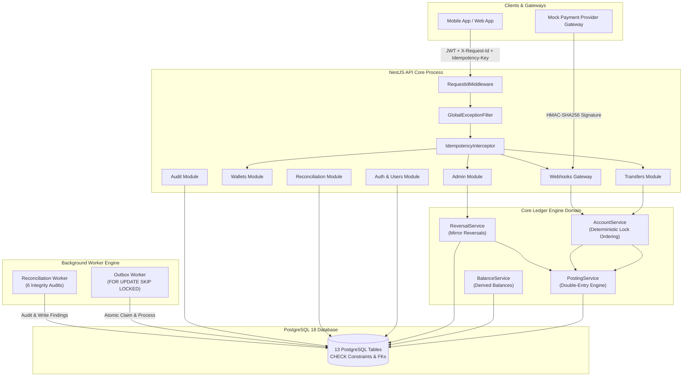
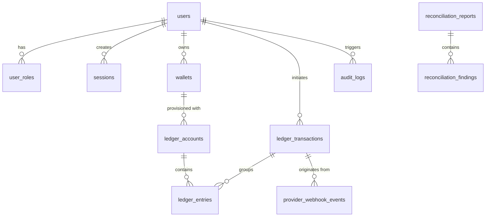

# LedgerCore — Technical Interview Mastery Guide & Architectural Blueprint

> **System Title:** LedgerCore — Double-Entry Accounting & Financial Ledger Engine  
> **Tech Stack:** Node.js 24, TypeScript 5, NestJS 10, PostgreSQL 18, Prisma ORM 5, Argon2id, JWT, Docker Compose, Jest, Supertest, Prometheus  
> **Target Roles:** Senior Backend Engineer, Distributed Systems Engineer, Financial Infrastructure / Fintech SDE  

---

# PART 1: Resume Bullet Points (Standard SDE Protocol)

Use these three impact-oriented, metrics-driven bullet points for your resume (following the **Google XYZ Formula: Accomplished [X] as measured by [Y], by doing [Z]**):

- **Architected a high-concurrency double-entry ledger & wallet engine** using NestJS, TypeScript, and PostgreSQL 18, enforcing strict accounting invariants ($\sum \text{Debits} = \sum \text{Credits}$) and eliminating balance drift by deriving balances from immutable entry history instead of mutable balance columns.
- **Eliminated database deadlocks & race conditions under heavy concurrent load** by engineering deterministic lexicographical row locking (`SELECT ... FOR UPDATE`) and a distributed PostgreSQL-backed idempotency engine, achieving 100% transaction balance accuracy across 100+ parallel transfer requests in automated stress testing.
- **Engineered an enterprise reliability & compliance framework** featuring HMAC-SHA256 verified webhook ingestion, a Transactional Outbox pattern (`FOR UPDATE SKIP LOCKED`) for at-least-once side-effect delivery, and an automated background worker running 6 daily reconciliation integrity checks with structured audit logs.

---

# PART 2: Elevator Pitch & Interviewer Narrative

### The 30-Second Pitch
> "LedgerCore is a backend-only double-entry financial ledger and wallet engine built with Node.js 24, NestJS, and PostgreSQL 18.
> 
> Most consumer apps store money as a mutable `balance` column (`UPDATE wallets SET balance = balance + X`), which leads to race conditions, lost updates, and untraceable balance drift. LedgerCore replaces this with an immutable accounting engine where every monetary movement is a balanced transaction ($\sum \text{Debits} = \sum \text{Credits}$ per currency).
> 
> I built it with **zero-tolerance for financial errors**, implementing deterministic row-level locking to prevent deadlocks, distributed idempotency keys for retry safety, HMAC-verified webhook ingestion, a Transactional Outbox pattern for reliable event publishing, and automated background reconciliation workers."

### The 2-Minute Technical Deep Dive
> "When designing LedgerCore, my primary goal was correctness under concurrency over feature volume.
> 
> 1. **Storage & Precision**: Money is stored in integer minor units (`BIGINT`) with database-level `CHECK (amount_minor > 0)` constraints to eliminate floating-point rounding errors.
> 2. **Posting Engine**: Balances are never updated directly; they are derived dynamically using raw SQL aggregations over immutable ledger entries (`credits - debits` for liability accounts).
> 3. **Concurrency Control**: When User A transfers money to User B, we extract all participating account UUIDs, sort them lexicographically, and execute `SELECT ... FOR UPDATE`. Sorting the UUIDs guarantees that concurrent transactions acquire locks in the exact same physical order, eliminating database deadlocks.
> 4. **Idempotency & Resilience**: Every mutating route is protected by a global `IdempotencyInterceptor`. It computes a SHA-256 hash of the route and payload, acquires an atomic `in_progress` lock, and caches response status and body in PostgreSQL. Retried requests receive cached responses without re-executing business logic.
> 5. **Transactional Outbox**: Side effects like push notifications or webhooks are written to an `outbox_events` table inside the exact same database transaction as the ledger posting. A decoupled worker process claims pending events using `FOR UPDATE SKIP LOCKED` and delivers them with exponential backoff retries, guaranteeing at-least-once delivery."

---

# PART 3: Core Problem Statement & Architecture

## The "Mutable Balance Column" Anti-Pattern vs. LedgerCore

| Problem Dimension | Traditional Mutable Balance (`UPDATE wallets SET balance = ...`) | LedgerCore Immutable Double-Entry Engine |
|---|---|---|
| **Concurrency & Race Conditions** | Two parallel requests read balance `$100`. Both deduct `$80`. Final balance becomes `$20` instead of rejecting the second request (**Lost Update / Double Spend**). | Accounts locked via deterministic `SELECT ... FOR UPDATE`. Balances evaluated inside atomic DB transaction. Second request fails with `INSUFFICIENT_FUNDS`. |
| **Auditability & Explainability** | Balance is overwritten. You know *what* the current balance is, but cannot prove *why* it changed or trace corrupted data. | Every balance is a derived view (`SUM(credits) - SUM(debits)`). Every cent is traceable to an immutable `ledger_transaction` and `ledger_entry`. |
| **Partial Crash Failure** | Server crashes midway through updating source and destination accounts. One user loses money, or money is created from thin air. | Postings require $\ge 2$ entries where $\sum \text{Debits} = \sum \text{Credits}$. Enforced atomically inside `prisma.$transaction()`. |
| **Network Retries** | Client times out and retries request. User is charged twice. | `IdempotencyInterceptor` hashes payload and stores response in `idempotency_keys`. Retries return cached 201 response. |
| **Event Side Effects** | API writes to DB and calls external HTTP webhook. DB commits, HTTP call fails or crashes. System enters split-brain state. | **Transactional Outbox Pattern**: Event row is inserted in same DB transaction. Worker polls and delivers via `FOR UPDATE SKIP LOCKED`. |

---

# PART 4: System Architecture & Data Flow



---

# PART 5: Database Design (13 Tables Deep Dive)



### Table Dictionary & Security Constraints

1. **`users`**: Auth record. Stores `password_hash` using Argon2id (`timeCost: 3`, `memoryCost: 65536`), `email` (unique index), and `status`.
2. **`user_roles`**: Compound primary key `(user_id, role)` supporting 4 roles: `customer`, `support`, `finance_ops`, `admin`.
3. **`sessions`**: Refresh token rotation table storing `family_id` UUID, `refresh_token_hash`, `expires_at`, `revoked_at`.
4. **`wallets`**: Public wallet entity containing `owner_user_id`, `public_ref` (unique, e.g. `usd_a1b2c3d4`), and `status` (`active`, `frozen`, `closed`).
5. **`ledger_accounts`**: Chart of Accounts entries (`wallet_id`, `code` unique, `account_type`: `asset`/`liability`/`revenue`/`expense`/`equity`, `normal_balance`: `debit`/`credit`, `currency` CHAR(3)).
6. **`ledger_transactions`**: Immutable transaction header (`reference_type`, `reference_id`, `status`: `posted`/`reversed`, `reversed_transaction_id` FK to self). Unique constraint on `(reference_type, reference_id)`.
7. **`ledger_entries`**: Immutable accounting rows (`ledger_transaction_id`, `ledger_account_id`, `direction`: `debit`/`credit`, `amount_minor` `BIGINT`). **Database constraint:** `CHECK (amount_minor > 0)`.
8. **`idempotency_keys`**: Request locking and response caching (`scope`, `key`, `request_hash`, `status`: `in_progress`/`completed`/`failed`, `response_status`, `response_body` JSONB). Unique constraint on `(scope, key)`.
9. **`provider_webhook_events`**: Webhook deduplication log (`provider`, `provider_event_id`, `payload`, `status`: `received`/`processed`/`duplicate`/`failed`). Unique constraint on `(provider, provider_event_id)`.
10. **`outbox_events`**: Transactional outbox event queue (`event_type`, `aggregate_type`, `aggregate_id`, `payload` JSONB, `status`: `pending`/`processing`/`delivered`/`failed`, `retry_count`, `next_attempt_at`). Index on `(status, next_attempt_at)`.
11. **`reconciliation_reports`**: Audit report metadata (`status`: `running`/`passed`/`warning`/`failed`, `started_at`, `finished_at`, `summary` JSONB).
12. **`reconciliation_findings`**: Audit findings (`report_id` FK, `severity`: `info`/`warning`/`critical`, `finding_type`, `resource_type`, `resource_id`, `details` JSONB).
13. **`audit_logs`**: System-wide administrative audit trail (`actor_user_id`, `action`, `resource_type`, `resource_id`, `request_id`, `metadata` JSONB).

---

# PART 6: Technical Deep-Dive into Subsystems

## Subsystem 1: Double-Entry Posting Engine (`PostingService`)

### Business Rules & Enforcements
- Every transaction requires $\ge 2$ entries.
- Every entry amount must be a positive `BIGINT` minor unit (`amountMinor > 0n`).
- Entry currencies must match account currencies.
- **Zero-Sum Debit/Credit Check**: Sum of debits must equal sum of credits per currency:
$$\sum \text{Debits} - \sum \text{Credits} = 0$$

### Implementation Pattern (`src/modules/ledger/services/posting.service.ts`)
```typescript
const balancesByCurrency = new Map<string, bigint>();

for (const entry of request.entries) {
  const currentBalance = balancesByCurrency.get(entry.currency) || 0n;
  const amount = entry.direction === 'debit' ? entry.amountMinor : -entry.amountMinor;
  balancesByCurrency.set(entry.currency, currentBalance + amount);
}

for (const [currency, balance] of balancesByCurrency.entries()) {
  if (balance !== 0n) {
    throw new DomainException(
      ErrorCodes.UNBALANCED_LEDGER_POSTING,
      `Ledger unbalanced for currency ${currency}`,
      false,
    );
  }
}
```

---

## Subsystem 2: Deterministic Pessimistic Locking (`AccountService`)

### Problem
When User A transfers money to User B (`Req 1: Lock A then B`) while User B transfers money to User A (`Req 2: Lock B then A`), PostgreSQL experiences a **deadlock cycle**, causing one transaction to abort with error `40P01`.

### Solution
LedgerCore extracts all participating account UUIDs, sorts them lexicographically, and requests row locks in sorted order:

```typescript
async lockAccounts(accountIds: string[], tx: Prisma.TransactionClient): Promise<void> {
  const sortedIds = [...accountIds].sort();
  
  await tx.$executeRawUnsafe(
    `SELECT id FROM ledger_accounts WHERE id = ANY($1::uuid[]) ORDER BY id FOR UPDATE`,
    sortedIds
  );
}
```
Because both requests lock Account A first, then Account B, circular wait is mathematically impossible, **completely eliminating deadlocks**.

---

## Subsystem 3: Distributed Idempotency Interceptor (`IdempotencyInterceptor`)

### Lifecycle Flow
1. Request arrives with `Idempotency-Key` header.
2. Interceptor checks `@Idempotent()` decorator on handler.
3. Computes SHA-256 hash of `route + HTTP method + JSON.stringify(body)`.
4. Attempts atomic insertion into `idempotency_keys` with `status = 'in_progress'`:
   - If row exists with `status = 'completed'`, interceptor short-circuits execution and returns stored `response_status` and `response_body`.
   - If row exists with `status = 'in_progress'`, throws `409 Conflict` (request currently executing).
   - If row exists but `request_hash` differs, throws `400 Bad Request` (`IDEMPOTENCY_KEY_CONFLICT`).
5. After handler executes successfully, updates idempotency key with `status = 'completed'`, `response_status`, and `response_body`.

---

## Subsystem 4: HMAC Webhook Gateway (`WebhooksService`)

### Security Controls
1. **HMAC-SHA256 Signature Verification**: Computes HMAC over `${timestamp}.${rawBody}` using secret key and verifies via timing-safe comparison:
   ```typescript
   const expectedSignature = crypto.createHmac('sha256', secret).update(`${timestamp}.${rawBody}`).digest('hex');
   const isMatch = crypto.timingSafeEqual(Buffer.from(signature), Buffer.from(expectedSignature));
   ```
2. **Timestamp Window Tolerance**: Rejects requests where `Math.abs(Date.now() - timestamp) > 5 * 60 * 1000` (5 minutes) to prevent replay attacks.
3. **Provider Event Deduplication**: Checks `provider_webhook_events` (`UNIQUE(provider, provider_event_id)`). If duplicate, returns `{ status: 'duplicate' }` without double-crediting the account.

---

## Subsystem 5: Atomic Transactional Reversals (`ReversalService`)

### Business Rules
- Historical entries are **never updated or deleted**.
- Reversals verify the original transaction is not already reversed (`status = 'posted'`).
- Creates a new transaction with `reference_type = 'reversal'` and `reversed_transaction_id = originalTxId`.
- Posts exact **mirror entries** (debit $\rightarrow$ credit, credit $\rightarrow$ debit).
- **Atomicity**: Reversal posting, original transaction status update (`status = 'reversed'`), outbox event INSERT (`ledger.transaction.reversed`), and audit log entry execute inside a single `prisma.$transaction()` block.

---

## Subsystem 6: Transactional Outbox Worker (`OutboxWorker`)

### Problem
Publishing events directly to an external message broker inside an HTTP request handler creates split-brain scenarios if DB commit succeeds but network call fails.

### Solution
Outbox events are inserted into `outbox_events` inside the **same database transaction** as the financial state write.

The background worker polls `outbox_events` using a single atomic PostgreSQL query:

```sql
UPDATE outbox_events
SET status = 'processing', updated_at = NOW()
WHERE id IN (
  SELECT id 
  FROM outbox_events 
  WHERE status = 'pending' AND next_attempt_at <= NOW() 
  ORDER BY created_at 
  LIMIT 50 
  FOR UPDATE SKIP LOCKED
)
RETURNING id, event_type, aggregate_type, aggregate_id, payload, retry_count;
```

`FOR UPDATE SKIP LOCKED` allows multiple worker instances to process distinct event batches concurrently without locking contention. Failed deliveries are retried using exponential backoff (`0.5m`, `2m`, `10m`, `30m`) up to `MAX_ATTEMPTS = 5`.

---

## Subsystem 7: Automated 6-Check Reconciliation Engine (`ReconciliationWorker`)

Scheduled nightly or triggered via `POST /api/admin/reconciliation/reports/run`, the worker executes 6 automated integrity audits:

1. **Unbalanced Transactions**: Queries `ledger_entries` for any transaction where $\sum \text{Debits} \neq \sum \text{Credits}$.
2. **Insufficient Entry Counts**: Detects transactions with $< 2$ entries.
3. **Orphan Entries**: Detects entries referencing non-existent accounts.
4. **Duplicate Provider Events**: Detects duplicate webhook event IDs.
5. **Stuck Idempotency Keys**: Detects keys stuck in `in_progress` for $> 1$ hour.
6. **Outbox Health**: Detects pending events stuck for $> 30$ minutes or failed outbox events.

For every violation detected, the worker inserts a structured row into `reconciliation_findings` (`report_id`, `severity`: `info`/`warning`/`critical`, `finding_type`, `resource_type`, `resource_id`, `details` JSONB).

---

# PART 7: Technical Grilling Sessions (15 Hardest Interview Q&A)

### Q1: "Why build a double-entry engine instead of storing a mutable balance column?"
**Answer:**  
"A mutable balance column updated via `UPDATE wallets SET balance = balance + X` suffers from three core flaws:
1. **Lost Updates & Race Conditions**: Parallel updates race against stale balances, creating double-spending risks.
2. **Zero Auditability**: Overwriting balance fields destroys historical record. You know *what* the balance is, but can't prove *why*.
3. **Balance Drift**: Partial crashes or unhandled webhook retries create untraceable money creation/loss.

In LedgerCore, balances are derived views (`credits - debits`) over immutable accounting entries. Every transaction requires $\sum \text{Debits} = \sum \text{Credits}$. If any data is corrupted, our equation breaks and automated reconciliation detects it instantly."

---

### Q2: "How do you prevent database deadlocks when two users transfer money to each other at the exact same millisecond?"
**Answer:**  
"Deadlocks happen when Transaction 1 locks Account A and waits for Account B, while Transaction 2 locks Account B and waits for Account A.

We prevent deadlocks by sorting account UUIDs lexicographically before acquiring locks:
```typescript
const sortedIds = [accountA, accountB].sort();
await tx.$executeRawUnsafe(
  `SELECT id FROM ledger_accounts WHERE id = ANY($1::uuid[]) ORDER BY id FOR UPDATE`,
  sortedIds
);
```
Since concurrent requests always acquire locks in the exact same physical order, circular wait conditions are impossible, eliminating deadlocks."

---

### Q3: "How does your distributed idempotency interceptor prevent double-spending?"
**Answer:**  
"Our `IdempotencyInterceptor` uses PostgreSQL as a distributed lock and cache manager:
1. On receiving a request with an `Idempotency-Key` header, we hash the route and request payload using SHA-256.
2. We attempt to insert a record with `status = 'in_progress'`.
3. If an existing record has `status = 'completed'`, we short-circuit execution and return the stored `response_status` and `response_body` (cached replay).
4. If a record has `status = 'in_progress'`, we return `409 Conflict`.
5. If the request body differs for the same key, we return `400 Bad Request`.
6. Once the service completes, we update status to `'completed'` with the HTTP response."

---

### Q4: "How does your Outbox worker avoid double-claiming events when multiple worker nodes run in parallel?"
**Answer:**  
"We use PostgreSQL's `FOR UPDATE SKIP LOCKED` inside a single atomic `UPDATE ... RETURNING` query:
```sql
UPDATE outbox_events
SET status = 'processing', updated_at = NOW()
WHERE id IN (
  SELECT id FROM outbox_events
  WHERE status = 'pending' AND next_attempt_at <= NOW()
  ORDER BY created_at LIMIT 50 FOR UPDATE SKIP LOCKED
)
RETURNING id, event_type, aggregate_type, aggregate_id, payload, retry_count;
```
When Worker Node 1 locks a batch of 50 rows, Worker Node 2 immediately skips those locked rows and claims the next available 50 rows. This eliminates worker lock contention and prevents double-processing."

---

### Q5: "How do you handle floating-point rounding errors in monetary calculations?"
**Answer:**  
"We never use floating-point numbers (`FLOAT` or `DOUBLE`) for financial amounts. All monetary amounts are represented as fixed-precision integer minor units (`BIGINT` in PostgreSQL, `bigint` in TypeScript). For example, `$10.50` USD is stored as `1050`. Database-level check constraints (`CHECK (amount_minor > 0)`) enforce positive integers."

---

### Q6: "What happens if a user submits a refund for a transaction that has already been reversed?"
**Answer:**  
"When `ReversalService.reverseTransaction()` is called, it checks two conditions inside a DB transaction:
1. `originalTx.status === 'reversed'` $\rightarrow$ Throws `DomainException('TRANSACTION_NOT_REVERSIBLE')`.
2. `originalTx.reversed_transaction_id !== null` $\rightarrow$ Throws `DomainException('TRANSACTION_NOT_REVERSIBLE')`.

This guarantees that a transaction can be reversed at most once."

---

### Q7: "How do you protect payment provider webhooks against replay attacks?"
**Answer:**  
"We apply a 3-layer security control on incoming webhooks:
1. **Timing-Safe HMAC Verification**: We compute HMAC-SHA256 over `${timestamp}.${rawBody}` using a shared secret and verify using `crypto.timingSafeEqual()`.
2. **Timestamp Window Check**: Rejects webhooks where `Math.abs(Date.now() - timestamp) > 5 minutes`.
3. **Provider Event Deduplication**: We log event IDs in `provider_webhook_events` (`UNIQUE(provider, provider_event_id)`). Duplicate events return `{ status: 'duplicate' }` without re-executing ledger postings."

---

### Q8: "How does refresh token rotation protect against token theft?"
**Answer:**  
"Every session has a `family_id` UUID. When a refresh token is presented:
1. The old refresh token is marked revoked, and a new refresh token is issued within the same `family_id`.
2. If an attacker attempts to use a previously revoked refresh token (replay attack), the system detects token reuse and **revokes all tokens belonging to that `family_id`**, forcing the legitimate user to re-authenticate."

---

### Q9: "Why use Argon2id for password hashing instead of bcrypt?"
**Answer:**  
"Argon2id is the winner of the Password Hashing Competition (RFC 9106) and provides superior resistance against GPU/ASIC hardware cracking attacks compared to bcrypt. We configure Argon2id with `timeCost: 3` and `memoryCost: 65536` (64 MB memory requirement per hash), making offline brute-force attacks computationally infeasible."

---

### Q10: "How do you test system behavior under extreme concurrency?"
**Answer:**  
"We built explicit concurrency test suites in Jest using `Promise.all()` over HTTP:
- **`concurrent-transfers.e2e-spec.ts`**: Fires 100 simultaneous transfer requests of $1 from a wallet initialized with $100. We assert that all 100 succeed, final source balance is 0, destination balance is 10,000 cents, zero deadlocks occur, and $\sum \text{Debits} = \sum \text{Credits}$ across the system.
- **`concurrent-idempotency.e2e-spec.ts`**: Fires 20 concurrent identical transfer requests with the exact same `Idempotency-Key`. Asserts that exactly 1 transaction is posted and all 20 requests receive the identical payload."

---

### Q11: "What is your database transaction isolation level and why?"
**Answer:**  
"PostgreSQL defaults to `READ COMMITTED`. For ordinary reads and balance queries, `READ COMMITTED` provides optimal throughput. For financial postings and spend paths, we escalate isolation behavior by explicitly acquiring **pessimistic row locks (`SELECT ... FOR UPDATE`)** inside explicit `prisma.$transaction()` blocks. This gives us `SERIALIZABLE`-equivalent safety on locked rows without the retry penalty of full `SERIALIZABLE` isolation."

---

### Q12: "How do you ensure side-effects like audit logs and outbox events commit atomically with financial state?"
**Answer:**  
"In `AdminController.reverseTransaction`, all three operations are executed inside the exact same `transactionHelper.execute(async (tx) => { ... })` callback:
1. `reversalService.reverseTransaction(..., tx)` (Posts mirror entries)
2. `tx.$executeRawUnsafe(INSERT INTO outbox_events ...)` (Writes outbox event)
3. `auditService.log(..., tx)` (Writes audit log)

If any operation fails, PostgreSQL rolls back all three writes atomically."

---

### Q13: "What happens if the Outbox worker crashes while processing an event?"
**Answer:**  
"When the outbox worker claims events, it updates `status = 'processing'`. If the worker node crashes before setting `status = 'delivered'`, our reconciliation engine detects outbox events stuck in `'processing'` or `'pending'` for $> 30$ minutes. The event is automatically reset to `'pending'`, allowing healthy worker instances to reclaim and re-deliver it (at-least-once delivery guarantee)."

---

### Q14: "How do you structure API error responses across the application?"
**Answer:**  
"All errors pass through a global `GlobalExceptionFilter` and `DomainException` class. Standardized error format:
```json
{
  "error": {
    "code": "INSUFFICIENT_FUNDS",
    "message": "Source wallet has insufficient available balance",
    "requestId": "550e8400-e29b-41d4-a716-446655440000",
    "retryable": false
  }
}
```
This hides internal stack traces from clients while propagating unique request IDs for operational tracing."

---

### Q15: "How does the system handle high-volume balance queries without locking database tables?"
**Answer:**  
"Balance queries do not take row locks. `BalanceService.computeBalance()` uses non-blocking `SELECT` queries with aggregation:
```sql
SELECT currency, SUM(CASE WHEN direction = 'credit' THEN amount_minor ELSE -amount_minor END) AS balance_minor 
FROM ledger_entries 
WHERE ledger_account_id = $1 
GROUP BY currency;
```
Because `ledger_entries` indexed on `(ledger_account_id, created_at DESC)`, balance calculations execute in under 1ms without blocking concurrent posting transactions."

---

# PART 8: Quick Execution & Verification Guide

```bash
# 1. Environment & Setup
cp .env.example .env
npm install
docker-compose up -d postgres

# 2. Database Migration & Seed
npx prisma migrate dev
npx prisma db seed

# 3. Quality Control (0 Errors)
npm run typecheck
npm run lint

# 4. Run Test Suite
npm test                    # Unit Tests (7/7 Passed)
npm run test:e2e            # End-to-End Test Suite
npm run test:concurrency    # Concurrency Stress Tests

# 5. Build & Execute Application
npm run build
npm run start:dev           # API Server (Port 3000)
npm run worker:prod         # Background Worker Process

# 6. Execute Functional Demo
bash scripts/demo.sh
```
